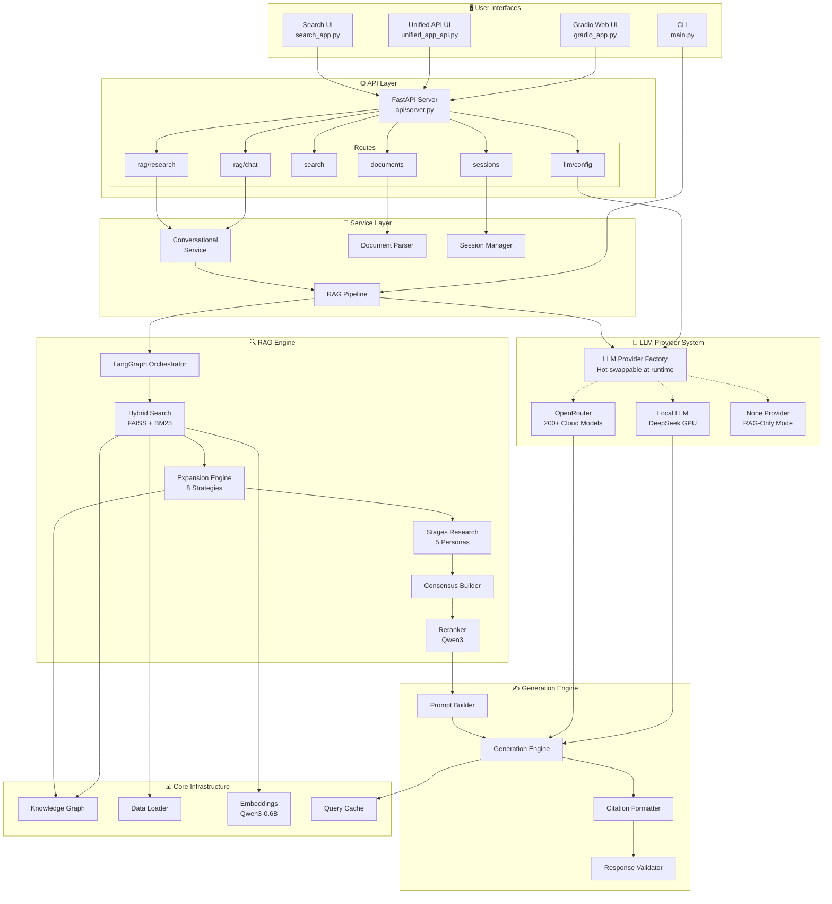
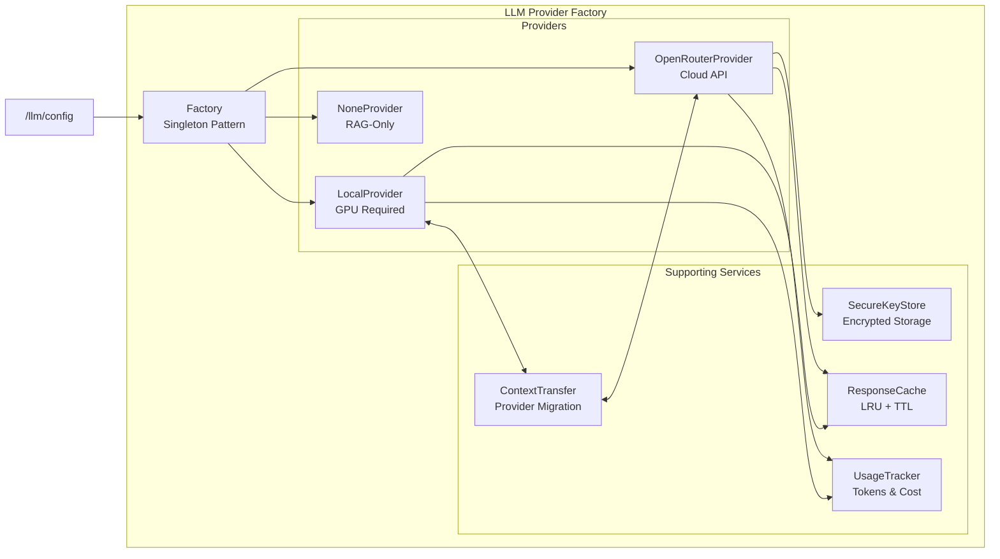
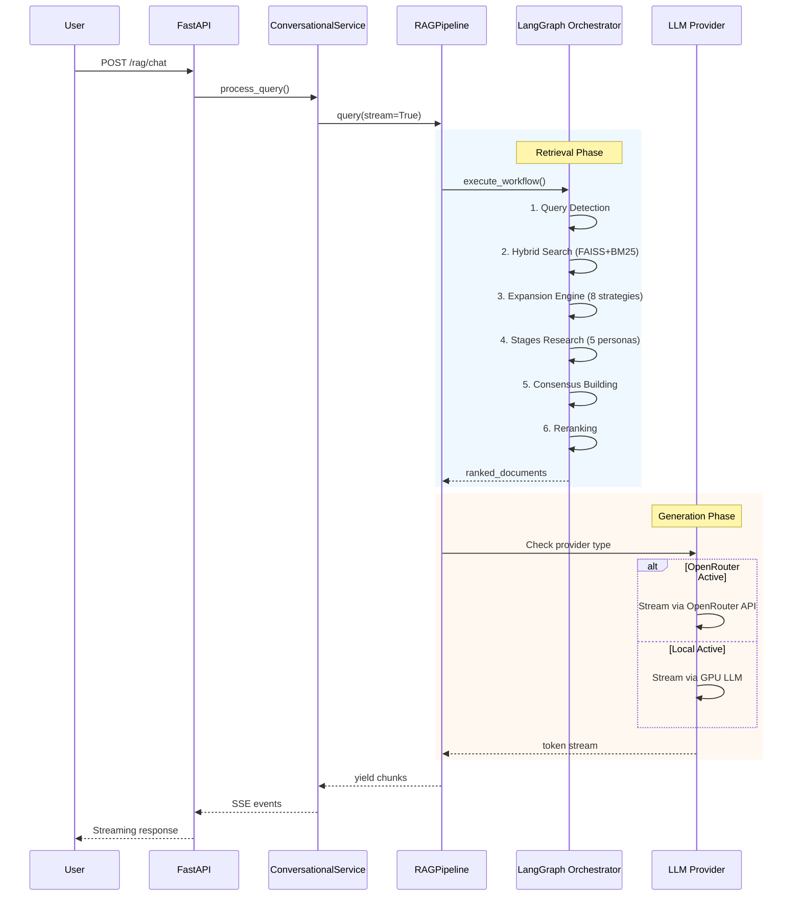
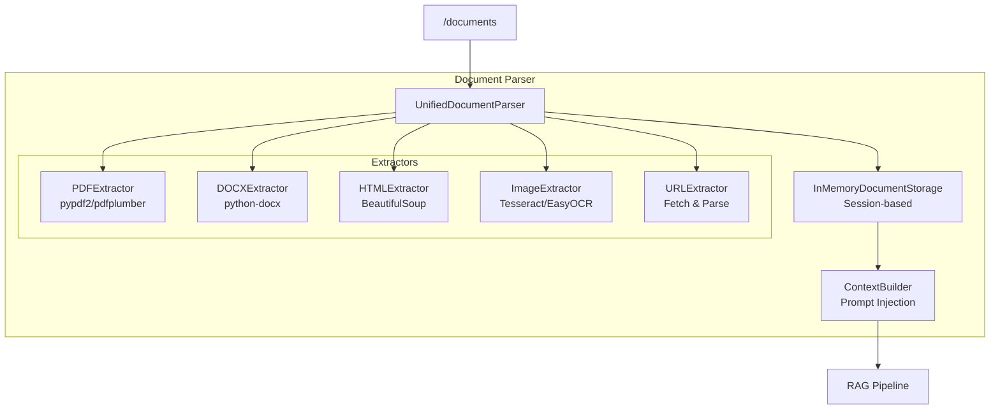
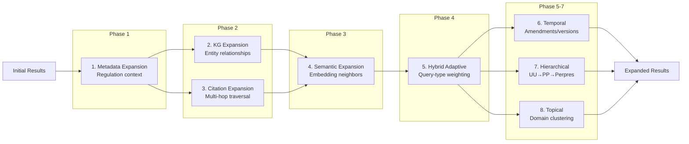
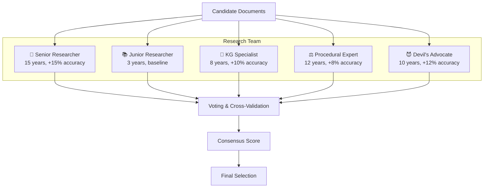
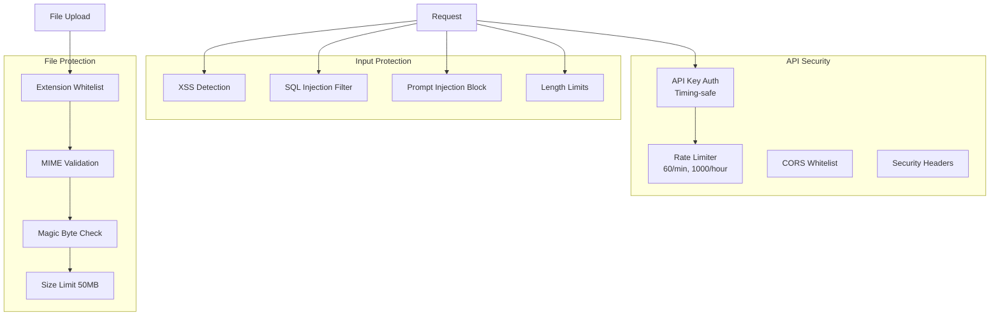

# KG-Enhanced Indonesian Legal RAG System

A sophisticated, modular Retrieval-Augmented Generation (RAG) system for Indonesian legal documents, featuring Knowledge Graph enhancement, multi-researcher team simulation, **Iterative Expansion Engine**, and LangGraph orchestration.

> ✅ **Status:** Production-ready for single-user deployments.  
> **Last Updated:** 2025-12-24

---

## Overview

This system provides intelligent legal consultation by combining:
- **Semantic Search** - Qwen3 embeddings with FAISS indexing
- **Iterative Expansion** - 8-strategy detective-style document discovery
- **Knowledge Graph** - Entity relationships and legal hierarchy
- **Multi-Researcher Simulation** - Team of specialized AI researchers
- **Consensus Building** - Cross-validation and agreement scoring
- **LLM Generation** - DeepSeek-based response generation with streaming

---

## 📋 Current Status & Roadmap

### Production Readiness: 9/10

| Component | Status | Notes |
|-----------|--------|-------|
| Core RAG Pipeline | ✅ Production Ready | Fully functional |
| Semantic + Keyword Search | ✅ Production Ready | FAISS-optimized |
| Knowledge Graph Enhancement | ✅ Production Ready | Community detection included |
| Multi-Researcher Simulation | ✅ Working | All 5 personas |
| LLM Generation (Local) | ✅ Production Ready | Streaming supported |
| Session Management | ✅ Functional | In-memory (no persistence) |
| Export (MD/JSON/HTML) | ✅ Production Ready | All formats working |
| REST API | ✅ Production Ready | Rate limiting + Auth |
| Gradio Web UI | ✅ Production Ready | 1108 lines, refactored |
| CLI Interface | ✅ Fully Functional | Interactive + single query |
| Docker Deployment | ✅ Ready | Tested configuration |
| Security | ✅ Implemented | XSS, injection, file validation |

### ✅ Implemented Security Features

| Feature | Implementation | Status |
|---------|----------------|--------|
| Rate Limiting | 60 req/min, 1000 req/hour per IP | ✅ |
| API Key Auth | Timing-safe comparison | ✅ |
| Input Validation | XSS, SQL injection, prompt injection | ✅ |
| Session ID Validation | Alphanumeric format enforcement | ✅ |
| CORS Whitelist | Restricted to known origins | ✅ |
| File Upload Protection | Extension + MIME + magic bytes | ✅ |
| Security Headers | X-Content-Type-Options, X-Frame-Options, etc. | ✅ |

### ⚠️ Outstanding for Multi-User Production

| Item | Priority | Impact |
|------|----------|--------|
| Session Persistence | Medium | Data lost on restart |
| Multi-user JWT Auth | Medium | Blocks multi-user scaling |

### ✅ Testing Status

All tests have been completed and verified:
- Unit tests (9 files)
- Integration tests (23 files)
- UI tests (gradio_app, search_app)
- Stress tests (conversational, single-user)
- Security integration tests

---

## System Architecture

### High-Level Microservices Architecture

The system is designed with a **microservices-like pattern** where components can be hot-swapped at runtime without restarting the server.



### LLM Provider System (Hot-Swappable)

Switch between providers at runtime via `/api/v1/llm/config`:



| Provider | Description | Requires | Best For |
|----------|-------------|----------|----------|
| `local` | GPU-based LLM (DeepSeek) | CUDA GPU | Production, offline |
| `openrouter` | 200+ cloud models | API Key | Testing, flexibility |
| `none` | Retrieval only, no LLM | Nothing | RAG-only mode |

### Data Flow (Query → Response)



### Document Parser Module



### Iterative Expansion Engine (8 Strategies)



### Research Team Simulation (5 Personas)



### Security Architecture



### Data Flow (Detailed)

```
User Query
    │
    ▼
┌─────────────────┐
│ Query Detection │ ← Analyze query type, extract entities, detect intent
└────────┬────────┘
         │
         ▼
┌─────────────────┐
│  Hybrid Search  │ ← Semantic (FAISS/Qwen3) + Keyword (BM25/TF-IDF)
└────────┬────────┘
         │
         ▼
┌─────────────────┐
│   Expansion     │ ← 8 strategies: metadata, KG, citation, semantic,
│    Engine       │   hybrid, temporal, hierarchical, topical
└────────┬────────┘
         │
         ▼
┌─────────────────┐
│ Stages Research │ ← Multi-stage filtering with 5 researcher personas
└────────┬────────┘
         │
         ▼
┌─────────────────┐
│    Consensus    │ ← Multi-researcher voting & cross-validation
└────────┬────────┘
         │
         ▼
┌─────────────────┐
│    Reranking    │ ← Final scoring with Qwen3 reranker
└────────┬────────┘
         │
         ▼
┌─────────────────┐
│   LLM Provider  │ ← Check: OpenRouter → External API
│    Selection    │         Local → GPU LLM
│                 │         None → Skip (RAG-only)
└────────┬────────┘
         │
         ▼
┌─────────────────┐
│   Generation    │ ← Streaming response with thinking process
└────────┬────────┘
         │
         ▼
    Response
```


### Iterative Expansion Engine (8 Strategies)

The expansion engine implements detective-style document discovery beyond initial scoring:

| Strategy | Phase | Description |
|----------|-------|-------------|
| **Metadata Expansion** | 1 | Fetch entire regulation context (preamble, attachments, related articles) |
| **KG Expansion** | 2 | Follow entity co-occurrence and relationships |
| **Citation Expansion** | 2 | Multi-hop citation network traversal (bidirectional) |
| **Semantic Expansion** | 3 | Find embedding space neighbors within cluster radius |
| **Hybrid Adaptive** | 4 | Query-type-specific strategy weighting |
| **Temporal Expansion** | 5 | Find amendments and version history |
| **Hierarchical Expansion** | 6 | Navigate legal hierarchy (UU → PP → Perpres) |
| **Topical Expansion** | 7 | Cluster by legal domain/topic |

**Conversational Mode:** Automatically detects multi-turn conversations and uses conservative expansion limits.

---

## Directory Structure

```
06_ID_Legal/
│
├── config.py                           # ✅ Centralized configuration (974 lines)
├── main.py                             # ✅ CLI entry point (399 lines)
├── conftest.py                         # ✅ Pytest fixtures
├── requirements.txt                    # ✅ Dependencies
├── pyproject.toml                      # ✅ Modern Python packaging
├── pytest.ini                          # ✅ Pytest configuration
├── Dockerfile                          # ✅ Docker image
├── docker-compose.yml                  # ✅ Docker orchestration
│
├── core/                               # Core RAG Components
│   ├── model_manager.py                # ✅ Model loading and management
│   ├── hardware_detection.py           # ✅ Multi-GPU auto-detection
│   ├── analytics.py                    # ✅ Usage analytics
│   ├── document_parser.py              # ✅ PDF/DOCX parsing
│   ├── form_generator.py               # ✅ Legal form generation
│   ├── legal_vocab.py                  # ✅ Legal vocabulary
│   │
│   ├── llm_providers/                  # 🆕 LLM Provider System (10 files)
│   │   ├── factory.py                  # ✅ Provider factory (hot-swap)
│   │   ├── base.py                     # ✅ Base provider interface
│   │   ├── local.py                    # ✅ Local GPU provider
│   │   ├── openrouter.py               # ✅ OpenRouter cloud provider
│   │   ├── none.py                     # ✅ RAG-only provider
│   │   ├── keystore.py                 # ✅ Encrypted API key storage
│   │   ├── cache.py                    # ✅ Response caching (LRU+TTL)
│   │   ├── usage_tracker.py            # ✅ Token & cost tracking
│   │   └── context_transfer.py         # ✅ Provider migration
│   │
│   ├── search/                         # Search Components (13 files)
│   │   ├── query_detection.py          # ✅ Query analysis
│   │   ├── hybrid_search.py            # ✅ FAISS + BM25 (919 lines)
│   │   ├── stages_research.py          # ✅ Multi-stage research
│   │   ├── consensus.py                # ✅ Consensus building
│   │   ├── reranking.py                # ✅ Final reranking
│   │   ├── langgraph_orchestrator.py   # ✅ LangGraph workflow
│   │   ├── expansion_engine.py         # ✅ Iterative Expansion (8 strategies)
│   │   ├── faiss_index_manager.py      # ✅ FAISS index management
│   │   └── query_cache.py              # ✅ Query result caching
│   │
│   ├── generation/                     # Generation Components (7 files)
│   │   ├── llm_engine.py               # ✅ LLM model management
│   │   ├── generation_engine.py        # ✅ Generation orchestration
│   │   ├── prompt_builder.py           # ✅ Prompt construction
│   │   ├── citation_formatter.py       # ✅ Citation formatting
│   │   └── response_validator.py       # ✅ Response validation
│   │
│   └── knowledge_graph/                # KG Components (6 files)
│       ├── kg_core.py                  # ✅ Entity extraction, scoring
│       ├── relationship_graph.py       # ✅ Network analysis
│       └── community_detection.py      # ✅ Dynamic communities
│
├── loader/                             # Data Loading
│   └── dataloader.py                   # ✅ Dataset loading
│
├── utils/                              # Shared Utilities (11 files)
│   ├── formatting.py                   # ✅ Document formatting
│   ├── text_utils.py                   # ✅ Text processing
│   ├── health.py                       # ✅ System health monitoring
│   ├── system_info.py                  # ✅ System information
│   ├── research_transparency.py        # ✅ Research process display
│   ├── logger_utils.py                 # ✅ Centralized logging
│   ├── memory_utils.py                 # ✅ Memory management
│   └── gpu_memory.py                   # ✅ GPU memory utilities
│
├── conversation/                       # Conversation Management (6 files)
│   ├── manager.py                      # ✅ Session state, history
│   ├── context_cache.py                # ✅ LRU cache with compression
│   ├── conversational_service.py       # ✅ Reusable RAG service
│   ├── memory_manager.py               # ✅ Enhanced memory management
│   └── export/                         # Export Formats
│       ├── markdown_exporter.py        # ✅ Markdown export
│       ├── json_exporter.py            # ✅ JSON export
│       └── html_exporter.py            # ✅ HTML export
│
├── api/                                # REST API Layer
│   ├── server.py                       # ✅ FastAPI server with lifespan
│   ├── validators.py                   # ✅ Input validation
│   ├── middleware/
│   │   ├── auth.py                     # ✅ API Key authentication
│   │   └── rate_limiter.py             # ✅ Rate limiting
│   └── routes/
│       ├── health.py                   # ✅ Health checks
│       ├── search.py                   # ✅ Search endpoints
│       ├── generate.py                 # ✅ Generation endpoints
│       ├── session.py                  # ✅ Session endpoints
│       ├── rag_enhanced.py             # ✅ Enhanced RAG + streaming
│       ├── llm.py                      # 🆕 LLM provider config
│       └── documents.py                # 🆕 Document upload/management
│
├── document_parser/                    # 🆕 Document Parser Module
│   ├── parser.py                       # ✅ Unified document parser
│   ├── storage.py                      # ✅ Session-based document storage
│   ├── context_builder.py              # ✅ Build context from documents
│   └── extractors/
│       ├── pdf.py                      # ✅ PDF extraction
│       ├── docx.py                     # ✅ Word document extraction
│       ├── html.py                     # ✅ HTML/web page extraction
│       ├── image.py                    # ✅ OCR (Tesseract/EasyOCR)
│       └── url.py                      # ✅ URL fetching & extraction
│
├── security/                           # Security Module (5 files)
│   ├── authentication.py               # ✅ API key validation
│   ├── input_safety.py                 # ✅ XSS, injection prevention
│   ├── rate_limiting.py                # ✅ Rate limiting utilities
│   └── file_protection.py              # ✅ Upload validation
│
├── ui/                                 # User Interface
│   ├── gradio_app.py                   # ✅ Gradio interface
│   ├── search_app.py                   # ✅ Search-only interface
│   ├── unified_app_api.py              # 🆕 API-based unified UI
│   └── services/
│       ├── api_client.py               # 🆕 API client for UI
│       └── system_service.py           # ✅ System initialization
│
├── pipeline/                           # High-Level Pipelines
│   ├── rag_pipeline.py                 # ✅ Complete RAG pipeline
│   ├── streaming_pipeline.py           # ✅ Streaming response
│   └── batch_pipeline.py               # ✅ Batch processing
│
├── tests/                              # Test Infrastructure
│   ├── unit/                           # 9 unit test files
│   │   ├── test_query_detection.py
│   │   ├── test_consensus.py
│   │   ├── test_hybrid_search.py
│   │   ├── test_knowledge_graph.py
│   │   ├── test_generation.py
│   │   └── conversation/
│   │       ├── test_manager.py
│   │       └── test_exporters.py
│   └── integration/                    # 23 integration test files
│       ├── test_api_endpoints.py
│       ├── test_production_ready.py
│       ├── test_streaming.py
│       ├── test_conversational.py
│       ├── test_security_integration.py
│       ├── test_stress_conversational.py
│       └── test_stress_single.py
│
└── deploy/                             # Deployment Configs
    ├── kubernetes/
    └── nginx/
```

---

## Quick Start

### Installation

```bash
# Clone repository
git clone https://github.com/azzindani/06_ID_Legal.git
cd 06_ID_Legal

# Install dependencies
pip install -r requirements.txt

# Copy environment file
cp .env.example .env
# Edit .env with your API key: LEGAL_API_KEY=your-key-here
```

### Running the System

#### Option 1: Command Line Interface
```bash
# Interactive mode
python main.py

# Single query
python main.py --query "Apa sanksi pelanggaran UU Ketenagakerjaan?"

# Export session
python main.py --export SESSION_ID --format md
```

#### Option 2: REST API
```bash
# Start API server
uvicorn api.server:app --host 0.0.0.0 --port 8000

# API docs at http://localhost:8000/docs
# Requires X-API-Key header for authenticated endpoints
```

#### Option 3: Web UI (Gradio)
```bash
python ui/gradio_app.py
# Open http://localhost:7860
```

#### Option 4: Docker
```bash
# API only
docker-compose up

# API + UI
docker-compose --profile ui up
```

### Simple Python Usage

```python
from pipeline import RAGPipeline

# Initialize
pipeline = RAGPipeline()
pipeline.initialize()

# Query
result = pipeline.query("Apa sanksi pelanggaran UU Ketenagakerjaan?")
print(result['answer'])

# Cleanup
pipeline.shutdown()
```

---

## Configuration

### Key Settings

```python
# config.py

DATASET_NAME = "Azzindani/ID_REG_DB_2510"
EMBEDDING_MODEL = "Qwen/Qwen3-Embedding-0.6B"
RERANKER_MODEL = "Qwen/Qwen3-Reranker-0.6B"
LLM_MODEL = "Azzindani/Deepseek_ID_Legal_Preview"

DEFAULT_CONFIG = {
    'initial_quality': 0.95,
    'quality_degradation': 0.1,
    'min_quality': 0.5,
    'consensus_threshold': 0.6,
    'final_top_k': 3,
    'max_rounds': 5,
    'temperature': 0.7,
    'max_new_tokens': 2048
}
```

### Search Phase Thresholds

| Phase | Candidates | Semantic | Keyword |
|-------|------------|----------|---------|
| initial_scan | 400 | 0.20 | 0.06 |
| focused_review | 150 | 0.35 | 0.12 |
| deep_analysis | 60 | 0.45 | 0.18 |
| verification | 30 | 0.55 | 0.22 |
| expert_review | 45 | 0.50 | 0.20 |

### Research Team Personas

| Persona | Experience | Accuracy Bonus |
|---------|------------|----------------|
| Senior Legal Researcher | 15 years | +15% |
| Junior Legal Researcher | 3 years | 0% |
| KG Specialist | 8 years | +10% |
| Procedural Expert | 12 years | +8% |
| Devil's Advocate | 10 years | +12% |

### Thinking Modes

| Mode | Max Tokens | Use Case |
|------|------------|----------|
| Low | 2048 | Quick answers, simple queries |
| Medium | 8192 | Standard legal analysis |
| High | 16384 | Deep research, complex questions |

---

## API Reference

### Endpoints

| Endpoint | Method | Auth | Description |
|----------|--------|------|-------------|
| `/api/v1/health` | GET | No | Health check |
| `/api/v1/ready` | GET | No | Readiness check |
| `/api/v1/rag/retrieve` | POST | Yes | Pure retrieval (no LLM) |
| `/api/v1/rag/research` | POST | Yes | Deep research mode |
| `/api/v1/rag/chat` | POST | Yes | Conversational RAG (streaming) |
| `/api/v1/session/{id}/history` | GET | Yes | Get session history |
| `/api/v1/session/{id}/export` | GET | Yes | Export session |
| `/api/v1/llm/providers` | GET | No | List available LLM providers |
| `/api/v1/llm/config` | POST | Yes | 🆕 Switch LLM provider at runtime |
| `/api/v1/llm/status` | GET | No | Get current LLM status |
| `/api/v1/llm/models` | GET | No | List available models |
| `/api/v1/documents` | GET | Yes | List session documents |
| `/api/v1/documents/upload` | POST | Yes | 🆕 Upload document to session |
| `/api/v1/documents/extract-url` | POST | Yes | 🆕 Extract content from URL |
| `/api/v1/documents/{id}` | DELETE | Yes | Delete document |

### Authentication

All authenticated endpoints require `X-API-Key` header:

```bash
curl -X POST "http://localhost:8000/api/v1/rag/chat" \
  -H "X-API-Key: your-api-key" \
  -H "Content-Type: application/json" \
  -d '{"query": "Apa itu UU Ketenagakerjaan?"}'
```

---

## Testing

### Run Tests

```bash
# Run all unit tests
pytest tests/unit/ -v

# Run integration tests (requires GPU)
pytest tests/integration/ -v -m integration

# Run specific test suites
python tests/integration/test_production_ready.py
python tests/integration/test_streaming.py
python tests/integration/test_conversational.py
python tests/integration/test_security_integration.py

# Run stress tests
python tests/integration/test_stress_conversational.py
python tests/integration/test_stress_single.py
```

### Test Coverage

| Category | Files | Coverage |
|----------|-------|----------|
| Unit Tests | 9 files | ~60-70% |
| Integration Tests | 23 files | ~80% |
| API Tests | 3 files | ~80% |
| Security Tests | 2 files | ✅ Good |
| Stress Tests | 2 files | ✅ Comprehensive |
| UI Tests | 0 files | ❌ Missing |

---

## Performance Notes

- **Embedding Model**: ~600M parameters, GPU recommended
- **Reranker Model**: ~600M parameters
- **LLM Model**: DeepSeek-based, supports streaming
- **Dataset**: ~100K+ regulation chunks with KG metadata

### Memory Optimization

- FAISS indexing for 10-100x faster semantic search
- BM25 keyword search for better term matching
- Lazy JSON parsing for KG data
- Chunked dataset loading (5000 records)
- Compressed embeddings (float16)
- Sparse TF-IDF matrices

---

## Security

The system implements multiple security layers:

### Input Protection
- XSS pattern detection
- SQL injection prevention
- Prompt injection blocking
- Input length limits (2000 chars)
- Null byte removal

### File Upload Protection
- Extension whitelist (pdf, doc, docx, txt, etc.)
- Dangerous extension blocklist (exe, bat, sh, js, dll, etc.)
- MIME type validation
- Magic byte verification
- Size limits (50MB default)

### API Security
- API Key authentication with timing-safe comparison
- Rate limiting (60 req/min, 1000 req/hour per IP)
- CORS whitelist
- Security headers (X-Content-Type-Options, X-Frame-Options, etc.)

---

## Two UI Modes

| Mode | File | Port | Description |
|------|------|------|-------------|
| Conversational UI | `ui/gradio_app.py` | 7860 | Full RAG + conversation history |
| Search Engine UI | `ui/search_app.py` | 7861 | Document retrieval only |

```bash
# Conversational UI
python ui/gradio_app.py

# Search Engine UI
python ui/search_app.py
```

---

## Contributing

1. Check the current status above
2. Pick a component or improvement
3. Follow existing code patterns
4. Include tests
5. Update this README

---

## License

[Specify license]

---

## Acknowledgments

- HuggingFace for model hosting
- Qwen team for embedding/reranker models
- DeepSeek for LLM foundation
