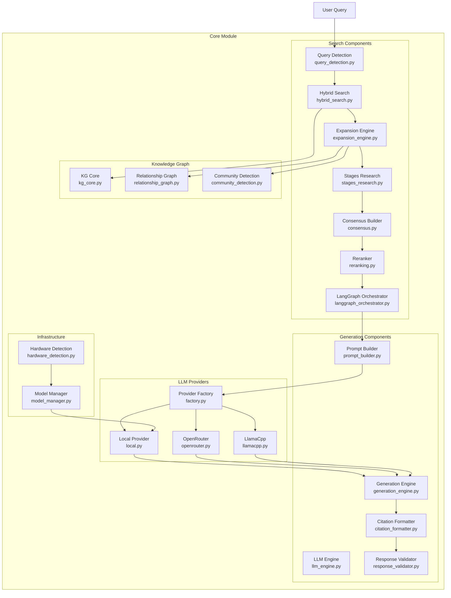

# Core Module

Core RAG components providing search, generation, and knowledge graph functionality for the Indonesian Legal RAG System.

## Architecture



## Directory Structure

```
core/
├── __init__.py                    # All exports
├── model_manager.py               # Model loading with hardware detection
├── hardware_detection.py          # GPU/CPU auto-detection
├── analytics.py                   # Usage analytics
├── document_parser.py             # Legacy document parser
├── form_generator.py              # Legal form generation
├── legal_vocab.py                 # Legal vocabulary
│
├── search/                        # Search components
│   ├── query_detection.py         # Query classification
│   ├── hybrid_search.py           # FAISS + BM25 search
│   ├── expansion_engine.py        # 8-strategy expansion
│   ├── stages_research.py         # Multi-stage research
│   ├── consensus.py               # Multi-researcher consensus
│   ├── reranking.py               # Final reranking
│   ├── langgraph_orchestrator.py  # LangGraph workflow
│   ├── faiss_index_manager.py     # FAISS index management
│   └── query_cache.py             # Query result caching
│
├── generation/                    # Generation components
│   ├── llm_engine.py              # LLM model management
│   ├── generation_engine.py       # Generation orchestration
│   ├── prompt_builder.py          # Prompt construction
│   ├── citation_formatter.py      # Citation formatting
│   └── response_validator.py      # Response validation
│
├── knowledge_graph/               # KG components
│   ├── kg_core.py                 # Entity extraction, scoring
│   ├── relationship_graph.py      # Document network
│   └── community_detection.py     # Dynamic communities
│
└── llm_providers/                 # LLM provider system
    ├── factory.py                 # Provider factory (hot-swap)
    ├── base.py                    # Base provider interface
    ├── local.py                   # Local GPU provider
    ├── openrouter.py              # OpenRouter cloud provider
    ├── llamacpp.py                # LlamaCpp GGUF provider
    ├── none.py                    # RAG-only provider
    ├── keystore.py                # Encrypted API key storage
    ├── cache.py                   # Response caching
    ├── usage_tracker.py           # Token & cost tracking
    └── context_transfer.py        # Provider migration
```

## Quick Usage

```python
from core import (
    QueryDetector,
    HybridSearchEngine,
    ExpansionEngine,
    ConsensusBuilder,
    GenerationEngine,
    KnowledgeGraphCore,
    get_model_manager
)

# Initialize model manager
model_manager = get_model_manager()
embedding_model = model_manager.load_embedding_model()
reranker = model_manager.load_reranker_model()

# Query detection
detector = QueryDetector()
query_info = detector.detect("Apa sanksi pelanggaran UU ITE?")
print(f"Type: {query_info['query_type']}")
print(f"Entities: {query_info['entities']}")

# Knowledge graph
kg = KnowledgeGraphCore()
kg_scores = kg.score_documents(results, query_info)
```

## Submodules

### Search (`search/`)

Multi-stage document retrieval with hybrid search, expansion, and consensus.

**Key Features:**
- Hybrid search (semantic + keyword)
- 8-strategy expansion engine
- 5-persona research team simulation
- Weighted consensus building
- Neural reranking

[→ Search README](search/README.md)

### Generation (`generation/`)

LLM response generation with prompt building and citation formatting.

**Key Features:**
- Streaming and non-streaming generation
- Thinking mode support (low/medium/high)
- Citation injection
- Response validation

[→ Generation README](generation/README.md)

### Knowledge Graph (`knowledge_graph/`)

Entity extraction, relationship mapping, and community detection.

**Key Features:**
- Legal entity recognition
- Citation network analysis
- Authority scoring
- Topic clustering

[→ Knowledge Graph README](knowledge_graph/README.md)

### LLM Providers (`llm_providers/`)

Hot-swappable LLM backends for flexible deployment.

**Available Providers:**
| Provider | Description | GPU Required |
|----------|-------------|--------------|
| `local` | HuggingFace transformers | ✅ Yes |
| `llamacpp` | GGUF models (hybrid) | Optional |
| `openrouter` | Cloud API (200+ models) | ❌ No |
| `none` | RAG-only mode | ❌ No |

```python
from core.llm_providers import get_provider

# Get current provider
provider = get_provider("openrouter", api_key="sk-or-...")

# Generate response
result = provider.generate(prompt, max_tokens=2048)
```

## Component Details

### Model Manager

Centralized model loading with intelligent hardware allocation.

```python
from core.model_manager import get_model_manager

manager = get_model_manager()

# Models are loaded to optimal devices
embedding = manager.load_embedding_model()  # GPU 0 or CPU
reranker = manager.load_reranker_model()    # GPU 1 or CPU

# Get model info
info = manager.get_model_info()
print(f"Embedding loaded: {info['embedding_model_loaded']}")
print(f"Device: {info['device']}")
```

### Hardware Detection

Automatic GPU/CPU allocation based on available resources.

```python
from core.hardware_detection import detect_hardware

config = detect_hardware()
print(f"GPU count: {config.gpu_count}")
print(f"VRAM available: {config.vram_available:.1f} GB")
print(f"Embedding device: {config.embedding_device}")
print(f"LLM device: {config.llm_device}")
print(f"LLM quantization: {config.llm_quantization}")
```

## Configuration

Key settings from `config.py`:

| Setting | Default | Description |
|---------|---------|-------------|
| `EMBEDDING_MODEL` | "Qwen/Qwen3-Embedding-0.6B" | Embedding model |
| `RERANKER_MODEL` | "Qwen/Qwen3-Reranker-0.6B" | Reranker model |
| `LLM_MODEL` | "Azzindani/Deepseek_ID_Legal_Preview" | Local LLM |
| `LLM_PROVIDER` | "local" | Default LLM provider |
| `DEVICE` | "auto" | Hardware selection |

## Testing

```bash
# Run all core tests
python -m pytest tests/unit/ -v -k "core"

# Specific component tests
python -m pytest tests/unit/test_query_detection.py -v
python -m pytest tests/unit/test_hybrid_search.py -v
python -m pytest tests/unit/test_consensus.py -v
python -m pytest tests/unit/test_knowledge_graph.py -v
python -m pytest tests/unit/test_generation.py -v
python -m pytest tests/unit/test_llm_providers.py -v
```

## Dependencies

- `torch`: Deep learning framework
- `transformers`: HuggingFace models
- `sentence-transformers`: CrossEncoder reranking
- `faiss-cpu` or `faiss-gpu`: Vector search
- `scipy`, `sklearn`: Numerical operations
- `networkx`: Graph algorithms
- `langgraph`: Workflow orchestration
