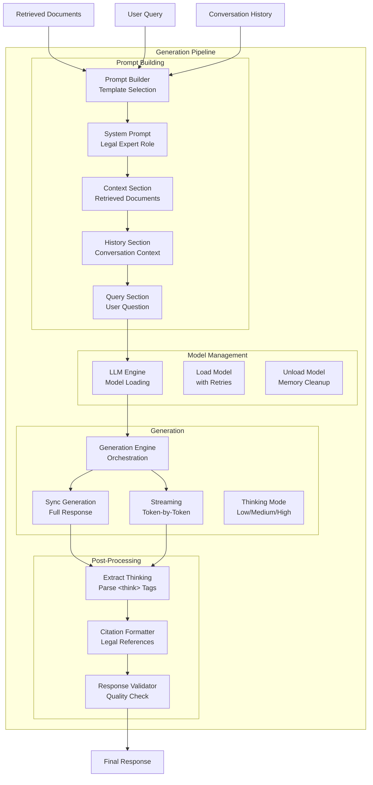

# Generation Module

LLM-based response generation for the Indonesian Legal RAG System. Handles model management, prompt construction, streaming generation, and citation formatting.

## Architecture



## Components

| File | Description | Key Classes/Functions |
|------|-------------|----------------------|
| `llm_engine.py` | LLM model loading and inference | `LLMEngine`, `generate()`, `generate_stream()` |
| `generation_engine.py` | Generation orchestration | `GenerationEngine`, `generate_answer()` |
| `prompt_builder.py` | Context-aware prompt construction | `PromptBuilder`, `build_prompt()` |
| `citation_formatter.py` | Legal citation formatting | `CitationFormatter`, `format_citations()` |
| `response_validator.py` | Response quality validation | `ResponseValidator`, `validate()` |

## Features

### 1. LLM Engine

Model loading with intelligent hardware allocation:

```python
from core.generation import LLMEngine

# Initialize engine
engine = LLMEngine(config={
    'model_name': 'Azzindani/Deepseek_ID_Legal_Preview',
    'max_new_tokens': 2048,
    'temperature': 0.7
})

# Load model (with retries)
engine.load_model(max_retries=3, retry_delay=5)

# Synchronous generation
result = engine.generate(
    prompt="Jelaskan tentang PT...",
    max_new_tokens=1024,
    temperature=0.7
)
print(result['text'])
print(f"Tokens: {result['tokens_generated']}")
print(f"Time: {result['generation_time']:.2f}s")

# Cleanup
engine.unload_model()
```

### 2. Streaming Generation

Token-by-token streaming for real-time display:

```python
from core.generation import LLMEngine

engine = LLMEngine()
engine.load_model()

# Stream tokens
for chunk in engine.generate_stream(prompt, max_new_tokens=1024):
    if chunk['type'] == 'token':
        print(chunk['token'], end='', flush=True)
    elif chunk['type'] == 'done':
        print(f"\n\nTotal tokens: {chunk['total_tokens']}")
```

### 3. Prompt Builder

Constructs optimized prompts based on query type:

```python
from core.generation import PromptBuilder

builder = PromptBuilder()

prompt = builder.build_prompt(
    query="Apa sanksi pelanggaran Pasal 27 UU ITE?",
    context=retrieved_documents,
    query_analysis={'query_type': 'sanctions', 'entities': ['UU ITE']},
    conversation_history=[
        {'role': 'user', 'content': 'Apa itu UU ITE?'},
        {'role': 'assistant', 'content': 'UU ITE adalah...'}
    ],
    thinking_mode='medium'
)
```

**Prompt Structure:**
```
[System Prompt - Legal Expert Role]

[Context Section]
## Dokumen Referensi:
### Dokumen 1: UU No. 11 Tahun 2008
{document_content}
...

[Conversation History]
## Riwayat Percakapan:
User: ...
Assistant: ...

[Query Section]
## Pertanyaan:
{user_query}

[Thinking Instructions - if applicable]
```

### 4. Thinking Modes

Three levels of reasoning depth:

| Mode | Token Budget | Use Case |
|------|--------------|----------|
| `low` | 512 | Quick factual answers |
| `medium` | 1024 | Balanced reasoning |
| `high` | 2048 | Complex legal analysis |

```python
from core.generation import GenerationEngine

engine = GenerationEngine(llm_engine)

# Low mode - fast
result = engine.generate_answer(
    query="Apa itu PT?",
    retrieved_results=docs,
    thinking_mode='low'
)

# High mode - deep analysis
result = engine.generate_answer(
    query="Jelaskan perbedaan PT dan CV dari segi hukum",
    retrieved_results=docs,
    thinking_mode='high'
)
```

### 5. Think Tag Extraction

Separates reasoning from final answer:

```python
from core.generation import GenerationEngine

engine = GenerationEngine(llm_engine)

# LLM output with <think> tags
raw_response = "<think>Let me analyze...</think>The answer is..."

# Automatic extraction
thinking, answer = engine._extract_thinking(raw_response)
print(f"Thinking: {thinking}")  # "Let me analyze..."
print(f"Answer: {answer}")      # "The answer is..."
```

### 6. Citation Formatter

Formats legal references consistently:

```python
from core.generation import CitationFormatter

formatter = CitationFormatter()

formatted = formatter.format_citations(
    answer="Menurut Pasal 27...",
    sources=[
        {'regulation_type': 'UU', 'number': '11', 'year': '2008', 'about': 'ITE'},
        {'regulation_type': 'PP', 'number': '71', 'year': '2019', 'about': 'PSTE'}
    ]
)

# Returns answer with properly formatted citations
```

### 7. Response Validation

Quality checks on generated responses:

```python
from core.generation import ResponseValidator

validator = ResponseValidator()

validation = validator.validate(
    response="Berdasarkan Pasal 27...",
    sources=source_documents,
    query_type='sanctions'
)

if not validation['valid']:
    print(f"Issues: {validation['issues']}")
```

**Validation Checks:**
- Response length (not too short/long)
- Citation presence
- Hallucination indicators
- Query-response relevance

## Complete Generation Flow

```python
from core.generation import (
    LLMEngine,
    GenerationEngine,
    PromptBuilder
)

# 1. Initialize components
llm_engine = LLMEngine()
llm_engine.load_model()

generator = GenerationEngine(llm_engine)

# 2. Generate with full pipeline
result = generator.generate_answer(
    query="Apa sanksi pelanggaran UU Ketenagakerjaan?",
    retrieved_results=documents,
    query_analysis={'query_type': 'sanctions'},
    conversation_history=history,
    stream=False,
    thinking_mode='medium'
)

# 3. Access results
print(result['answer'])
print(f"Thinking: {result.get('thinking', '')}")
print(f"Tokens: {result['tokens_generated']}")
print(f"Time: {result['generation_time']:.2f}s")

# 4. Cleanup
llm_engine.unload_model()
```

## Configuration

| Setting | Default | Description |
|---------|---------|-------------|
| `max_new_tokens` | 2048 | Maximum tokens to generate |
| `temperature` | 0.7 | Sampling temperature |
| `top_p` | 0.9 | Nucleus sampling |
| `top_k` | 50 | Top-k sampling |
| `repetition_penalty` | 1.1 | Repetition penalty |
| `do_sample` | true | Enable sampling |

## Memory Management

```python
# Before generation
from utils.memory_utils import prepare_for_llm
prepare_for_llm()

# Generate
result = generator.generate_answer(...)

# After generation (optional cleanup)
from utils.memory_utils import cleanup_memory
cleanup_memory(aggressive=False)
```

## Testing

```bash
# Run generation tests
python -m pytest tests/unit/test_generation.py -v

# Test streaming
python -c "
from core.generation import LLMEngine
engine = LLMEngine()
engine.load_model()
for chunk in engine.generate_stream('Hello'):
    print(chunk)
"
```
