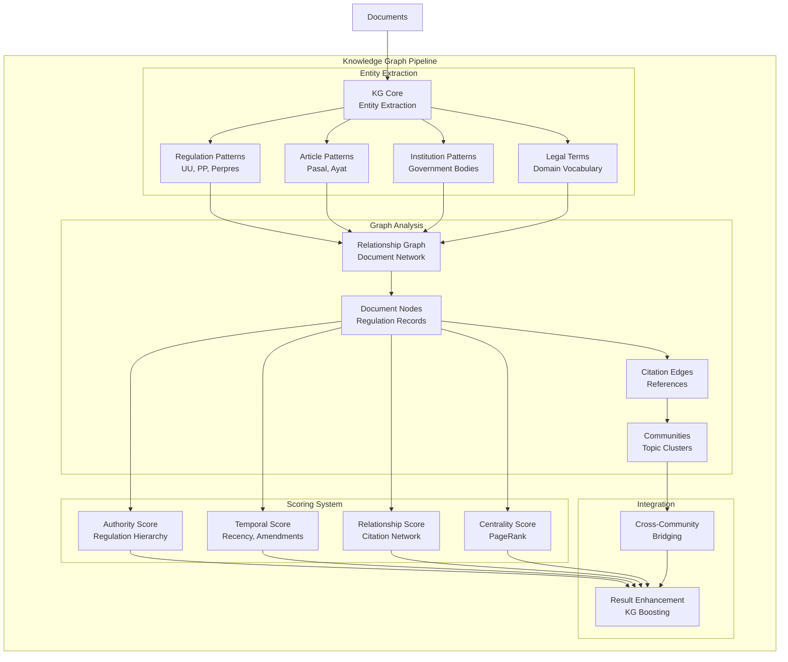

# Knowledge Graph Module

Graph-based document analysis, entity extraction, and relevance scoring for the Indonesian Legal RAG System.

## Architecture



## Components

| File | Description | Key Classes/Functions |
|------|-------------|----------------------|
| `kg_core.py` | Entity extraction and document scoring | `KnowledgeGraphCore`, `extract_entities()`, `score_document()` |
| `relationship_graph.py` | Document citation network | `RelationshipGraph`, `build_graph()`, `get_related_documents()` |
| `community_detection.py` | Topic clustering and community analysis | `CommunityDetector`, `detect_communities()`, `get_community_members()` |

## Features

### 1. Entity Extraction

Extracts legal entities from Indonesian legal documents:

```python
from core.knowledge_graph import KnowledgeGraphCore

kg = KnowledgeGraphCore()

# Extract entities from text
entities = kg.extract_entities(
    "Berdasarkan Pasal 27 ayat (3) UU No. 11 Tahun 2008 "
    "tentang Informasi dan Transaksi Elektronik (UU ITE)..."
)

print(entities)
# {
#     'regulations': [
#         {'type': 'UU', 'number': '11', 'year': '2008', 'about': 'ITE'}
#     ],
#     'articles': [
#         {'pasal': '27', 'ayat': '3'}
#     ],
#     'institutions': [],
#     'legal_terms': ['informasi', 'transaksi elektronik']
# }
```

**Entity Types:**
| Type | Pattern Examples |
|------|-----------------|
| `regulation` | "UU No. 11 Tahun 2008", "PP 71/2019", "Perpres 95 Tahun 2018" |
| `article` | "Pasal 27", "Pasal 1 ayat (3)", "Pasal 27-30" |
| `institution` | "Kementerian Ketenagakerjaan", "Mahkamah Konstitusi" |
| `legal_term` | "perseroan terbatas", "hak cipta", "wanprestasi" |

### 2. Authority Scoring

Scores documents by regulation hierarchy:

```python
from core.knowledge_graph import KnowledgeGraphCore

kg = KnowledgeGraphCore()

# Authority hierarchy: UU > PP > Perpres > Permen > Perda
authority = kg.calculate_authority_score({
    'regulation_type': 'UU',
    'regulation_number': '13',
    'year': '2003'
})

print(f"Authority score: {authority:.2f}")  # 1.0 for UU
```

**Hierarchy Scores:**
| Type | Score |
|------|-------|
| Undang-Undang (UU) | 1.0 |
| Peraturan Pemerintah (PP) | 0.9 |
| Peraturan Presiden (Perpres) | 0.8 |
| Peraturan Menteri (Permen) | 0.7 |
| Peraturan Daerah (Perda) | 0.6 |

### 3. Temporal Scoring

Scores based on recency and amendments:

```python
from core.knowledge_graph import KnowledgeGraphCore

kg = KnowledgeGraphCore()

# Recent laws score higher
temporal = kg.calculate_temporal_score({
    'year': '2020',
    'is_amendment': False,
    'amends': None
})

print(f"Temporal score: {temporal:.2f}")
```

### 4. Relationship Graph

Build and query document citation networks:

```python
from core.knowledge_graph import RelationshipGraph

graph = RelationshipGraph()

# Build from documents
graph.build_from_documents(documents, kg_core)

# Find related documents
related = graph.get_related_documents(
    document_id='doc-123',
    max_depth=2,
    min_similarity=0.5
)

# Get citation chain
citations = graph.get_citation_chain('doc-123')
for cited_doc in citations:
    print(f"  Cites: {cited_doc['title']}")
```

### 5. Community Detection

Cluster documents by topic using Louvain algorithm:

```python
from core.knowledge_graph import CommunityDetector

detector = CommunityDetector()

# Detect communities
communities = detector.detect_communities(
    graph=relationship_graph,
    resolution=1.0
)

# List communities
for comm_id, members in communities.items():
    print(f"Community {comm_id}: {len(members)} members")
    
# Get specific community
labor_community = detector.get_community_by_topic('ketenagakerjaan')
```

### 6. Result Enhancement

Boost search results with KG scores:

```python
from core.knowledge_graph import KnowledgeGraphCore

kg = KnowledgeGraphCore()

# Enhance search results with KG scoring
enhanced = kg.enhance_results(
    results=search_results,
    query="Sanksi pelanggaran UU Ketenagakerjaan",
    query_entities=extracted_entities,
    kg_weight=0.3  # 30% KG influence
)

# Results now have kg_score field
for result in enhanced:
    print(f"{result['title']}: {result['kg_score']:.3f}")
```

## Score Calculation

The KG provides multiple scoring dimensions that combine with search scores:

```
final_score = (1 - kg_weight) × search_score + kg_weight × kg_score

kg_score = (
    authority_weight × authority_score +
    temporal_weight × temporal_score +
    centrality_weight × centrality_score +
    entity_match_weight × entity_match_score
)
```

**Default Weights:**
| Component | Weight |
|-----------|--------|
| Authority | 0.3 |
| Temporal | 0.2 |
| Centrality | 0.2 |
| Entity Match | 0.3 |

## Integration with Search

```python
from core.search import HybridSearchEngine
from core.knowledge_graph import KnowledgeGraphCore

# 1. Perform search
engine = HybridSearchEngine(...)
results = engine.search(query)

# 2. Extract entities from query
kg = KnowledgeGraphCore()
query_entities = kg.extract_entities(query)

# 3. Enhance with KG scores
enhanced = kg.enhance_results(results, query, query_entities)

# 4. Use in consensus building
consensus = builder.build(enhanced, researcher_weights={
    'kg_expert': 0.15,  # KG expert uses KG scores
    ...
})
```

## Configuration

| Setting | Default | Description |
|---------|---------|-------------|
| `kg_weight` | 0.3 | KG influence on final score |
| `authority_weight` | 0.3 | Authority component weight |
| `temporal_weight` | 0.2 | Temporal component weight |
| `centrality_weight` | 0.2 | PageRank centrality weight |
| `entity_match_weight` | 0.3 | Entity overlap weight |
| `community_resolution` | 1.0 | Louvain resolution parameter |

## Testing

```bash
# Run KG tests
python -m pytest tests/unit/test_knowledge_graph.py -v

# Test entity extraction
python -c "
from core.knowledge_graph import KnowledgeGraphCore
kg = KnowledgeGraphCore()
entities = kg.extract_entities('UU No. 13 Tahun 2003')
print(entities)
"
```

## Dependencies

- `networkx`: Graph operations
- `community` (python-louvain): Community detection
- `numpy`: Numerical operations
- `re`: Pattern matching
