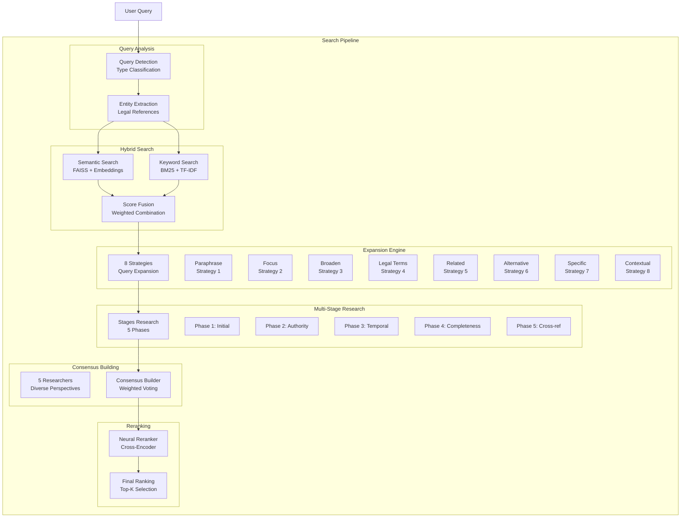

# Search Module

Multi-stage document retrieval system for the Indonesian Legal RAG System. Implements hybrid search, query expansion, multi-researcher consensus, and neural reranking.

## Architecture



## Components

| File | Description | Key Classes/Functions |
|------|-------------|----------------------|
| `query_detection.py` | Query classification and entity extraction | `QueryDetector`, `detect_query_type()` |
| `hybrid_search.py` | FAISS semantic + BM25 keyword search | `HybridSearchEngine`, `search()` |
| `expansion_engine.py` | 8-strategy query expansion | `ExpansionEngine`, `expand_query()` |
| `stages_research.py` | Multi-stage research with personas | `StagesResearch`, `research()` |
| `consensus.py` | Multi-researcher consensus building | `ConsensusBuilder`, `build_consensus()` |
| `reranking.py` | Neural cross-encoder reranking | `Reranker`, `rerank()` |
| `langgraph_orchestrator.py` | LangGraph workflow orchestration | `LangGraphOrchestrator`, `run()` |
| `faiss_index_manager.py` | FAISS index management | `FaissIndexManager` |
| `query_cache.py` | Query result caching | `QueryCache` |

## Features

### 1. Query Detection

Classifies query type and extracts legal entities:

```python
from core.search import QueryDetector

detector = QueryDetector()
result = detector.detect("Apa sanksi pelanggaran Pasal 27 UU ITE?")

print(f"Type: {result['query_type']}")  # 'sanctions'
print(f"Entities: {result['entities']}")  # ['UU ITE', 'Pasal 27']
print(f"Keywords: {result['keywords']}")  # ['sanksi', 'pelanggaran']
```

**Query Types:**
| Type | Pattern | Example |
|------|---------|---------|
| `definition` | "Apa itu X?" | "Apa itu perseroan terbatas?" |
| `procedure` | "Bagaimana cara X?" | "Bagaimana prosedur pendirian PT?" |
| `requirement` | "Apa syarat X?" | "Apa syarat pendaftaran merek?" |
| `sanctions` | "Apa sanksi X?" | "Apa sanksi pelanggaran UU ITE?" |
| `comparison` | "Perbedaan X dan Y" | "Perbedaan PT dan CV" |
| `general` | Other | Any other legal question |

### 2. Hybrid Search

Combines semantic (dense) and keyword (sparse) search:

```python
from core.search import HybridSearchEngine

engine = HybridSearchEngine(
    records=dataset.records,
    embeddings=dataset.embeddings,
    tfidf_matrix=dataset.tfidf_matrix,
    embedding_model=model
)

results = engine.search(
    query="Syarat pendirian PT",
    top_k=20,
    semantic_weight=0.7,
    keyword_weight=0.3
)
```

**Score Calculation:**
```
final_score = (semantic_weight × semantic_score) + (keyword_weight × keyword_score)
```

### 3. Expansion Engine (8 Strategies)

```python
from core.search import ExpansionEngine

engine = ExpansionEngine(embedding_model=model)

expansions = engine.expand(
    query="Sanksi pelanggaran UU Ketenagakerjaan",
    strategies=['paraphrase', 'legal', 'related']
)

for exp in expansions:
    print(f"Strategy: {exp['strategy']}")
    print(f"Expanded: {exp['query']}")
```

**Available Strategies:**
| Strategy | Description |
|----------|-------------|
| `paraphrase` | Reword query differently |
| `focus` | Narrow to specific aspect |
| `broaden` | Expand to broader topic |
| `legal` | Add legal terminology |
| `related` | Add related concepts |
| `alternative` | Alternative phrasing |
| `specific` | Add specific references |
| `contextual` | Add context from history |

### 4. Multi-Stage Research

5-phase research with quality thresholds:

```python
from core.search import StagesResearch

research = StagesResearch(config={
    'initial_quality': 0.95,
    'quality_degradation': 0.1,
    'min_quality': 0.5,
    'max_rounds': 5
})

results = research.research(
    query="Prosedur PHK menurut UU Cipta Kerja",
    initial_results=hybrid_results
)
```

**Phase Characteristics:**
| Phase | Focus | Quality Threshold |
|-------|-------|-------------------|
| 1 | Initial high-quality | 0.95 |
| 2 | Authority-focused | 0.85 |
| 3 | Temporal relevance | 0.75 |
| 4 | Completeness | 0.65 |
| 5 | Cross-references | 0.50 |

### 5. Consensus Building

5-researcher simulation with weighted voting:

```python
from core.search import ConsensusBuilder

builder = ConsensusBuilder()

# Each "researcher" has different priorities
consensus = builder.build(
    candidates=research_results,
    researcher_weights={
        'semantic_expert': 0.25,
        'authority_expert': 0.2,
        'temporal_expert': 0.2,
        'completeness_expert': 0.2,
        'kg_expert': 0.15
    }
)
```

**Researcher Personas:**
| Persona | Priority |
|---------|----------|
| Semantic Expert | Text similarity scores |
| Authority Expert | Regulation hierarchy (UU > PP > Perpres) |
| Temporal Expert | Recent amendments, current law |
| Completeness Expert | Coverage of all aspects |
| KG Expert | Knowledge graph relationships |

### 6. Neural Reranking

Cross-encoder reranking for final selection:

```python
from core.search import Reranker

reranker = Reranker(model=cross_encoder_model)

final = reranker.rerank(
    query="Sanksi UU ITE",
    candidates=consensus_results,
    top_k=10
)
```

### 7. LangGraph Orchestrator

End-to-end workflow orchestration:

```python
from core.search import LangGraphOrchestrator

orchestrator = LangGraphOrchestrator(
    search_engine=hybrid_engine,
    expansion_engine=expansion_engine,
    stages_research=research,
    consensus_builder=builder,
    reranker=reranker
)

result = orchestrator.run(
    query="Apa sanksi pelanggaran UU Ketenagakerjaan?",
    config=rag_config
)
```

## Configuration

| Setting | Default | Description |
|---------|---------|-------------|
| `semantic_weight` | 0.7 | Weight for semantic scores |
| `keyword_weight` | 0.3 | Weight for keyword scores |
| `max_results` | 20 | Max results per search |
| `consensus_threshold` | 0.6 | Minimum consensus score |
| `quality_degradation` | 0.1 | Quality drop per phase |
| `max_rounds` | 5 | Maximum research phases |

## Testing

```bash
# Run search tests
python -m pytest tests/unit/test_hybrid_search.py -v
python -m pytest tests/unit/test_query_detection.py -v
python -m pytest tests/unit/test_consensus.py -v
```
