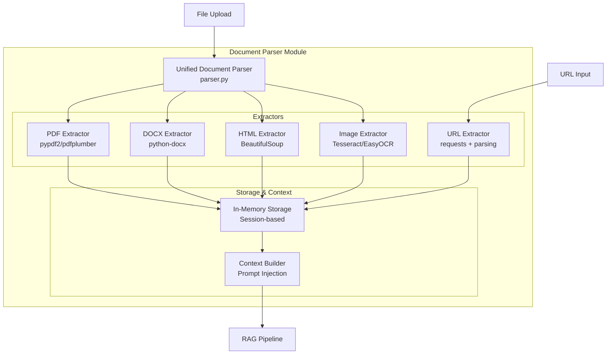

# Document Parser Module

Unified document parsing and extraction module for the Indonesian Legal RAG System. Supports PDF, DOCX, HTML, images (OCR), and URL extraction with session-based storage.

## Architecture



## Components

| File | Description | Key Classes |
|------|-------------|-------------|
| `parser.py` | Unified document parser | `UnifiedDocumentParser` |
| `storage.py` | Session-based document storage | `InMemoryDocumentStorage` |
| `context_builder.py` | Build context for RAG | `DocumentContextBuilder` |
| `extractors/pdf.py` | PDF text extraction | `PDFExtractor` |
| `extractors/docx.py` | Word document extraction | `DOCXExtractor` |
| `extractors/html.py` | HTML/web page extraction | `HTMLExtractor` |
| `extractors/image.py` | OCR-based image extraction | `ImageExtractor` |
| `extractors/url.py` | URL fetching and extraction | `URLExtractor` |

## Features

### Supported Formats

| Format | Extensions | Extractor | Dependencies |
|--------|------------|-----------|--------------|
| PDF | `.pdf` | pypdf2, pdfplumber | `pip install pypdf2 pdfplumber` |
| Word | `.docx`, `.doc` | python-docx | `pip install python-docx` |
| HTML | `.html`, `.htm` | BeautifulSoup | `pip install beautifulsoup4` |
| Images | `.png`, `.jpg`, `.jpeg`, `.gif`, `.bmp`, `.tiff` | Tesseract/EasyOCR | System: tesseract-ocr |
| URLs | `http://`, `https://` | requests | `pip install requests` |

### Usage

#### Basic Document Parsing

```python
from document_parser import UnifiedDocumentParser

# Initialize parser
parser = UnifiedDocumentParser()

# Parse a document
result = parser.parse("document.pdf")

if result['success']:
    print(f"Extracted {len(result['text'])} characters")
    print(f"Pages: {result['metadata'].get('page_count', 'N/A')}")
else:
    print(f"Error: {result['error']}")
```

#### Session-Based Storage

```python
from document_parser import get_storage

# Get storage instance
storage = get_storage()

# Store document for a session
doc_id = storage.store_document(
    session_id="user-123",
    filename="contract.pdf",
    content_type="application/pdf",
    extracted_text="Full document text...",
    metadata={"pages": 10}
)

# Retrieve documents for session
docs = storage.get_session_documents("user-123")
for doc in docs:
    print(f"  - {doc['filename']}: {len(doc['extracted_text'])} chars")

# Get specific document text
doc_texts = storage.get_documents_text([doc_id])
```

#### Building RAG Context

```python
from document_parser import DocumentContextBuilder

builder = DocumentContextBuilder()

# Build context from documents
documents = [
    {"filename": "contract.pdf", "extracted_text": "..."},
    {"filename": "policy.docx", "extracted_text": "..."}
]

context = builder.build_prompt_section(documents)
# Returns formatted context for injection into RAG prompt
```

#### URL Extraction

```python
from document_parser import UnifiedDocumentParser

parser = UnifiedDocumentParser()

# Extract content from URL
result = parser.extract_url("https://example.com/legal-document")

if result['success']:
    print(f"Title: {result['metadata'].get('title', 'N/A')}")
    print(f"Content: {result['text'][:500]}...")
```

### Integration with RAG Pipeline

The document parser integrates with the RAG pipeline through the API:

```python
# In API routes (api/routes/rag_enhanced.py)
from document_parser import is_initialized, get_storage
from document_parser.context_builder import DocumentContextBuilder

# Build document context for query
if is_initialized() and session_id:
    storage = get_storage()
    docs = storage.get_session_documents(session_id, include_text=True)
    
    builder = DocumentContextBuilder()
    document_context = builder.build_prompt_section(docs)
    
    # Prepend to query
    enhanced_query = f"{document_context}\n\n{query}"
```

### API Endpoints

The document parser is exposed through the API:

| Endpoint | Method | Description |
|----------|--------|-------------|
| `/api/v1/documents` | GET | List session documents |
| `/api/v1/documents/upload` | POST | Upload and parse document |
| `/api/v1/documents/extract-url` | POST | Extract content from URL |
| `/api/v1/documents/{id}` | DELETE | Delete document |

**Upload Example:**

```bash
curl -X POST "http://localhost:8000/api/v1/documents/upload" \
  -H "X-API-Key: your-key" \
  -F "file=@document.pdf" \
  -F "session_id=user-123"
```

**Response:**

```json
{
  "success": true,
  "document_id": "uuid-123",
  "filename": "document.pdf",
  "content_type": "application/pdf",
  "size_bytes": 1024000,
  "extracted_text_length": 50000,
  "metadata": {
    "page_count": 25,
    "has_ocr": false
  }
}
```

## Configuration

| Variable | Default | Description |
|----------|---------|-------------|
| `MAX_UPLOAD_SIZE_MB` | 50 | Maximum file upload size |
| `OCR_ENGINE` | "tesseract" | OCR engine (tesseract/easyocr) |
| `TESSERACT_PATH` | auto-detect | Path to tesseract executable |
| `MAX_DOCUMENT_CHARS` | 100000 | Max chars per document in context |

## Error Handling

```python
from document_parser import UnifiedDocumentParser

parser = UnifiedDocumentParser()
result = parser.parse("unknown.xyz")

if not result['success']:
    error_type = result.get('error_type', 'unknown')
    
    if error_type == 'unsupported_format':
        print("File format not supported")
    elif error_type == 'extraction_failed':
        print(f"Extraction error: {result['error']}")
    elif error_type == 'file_not_found':
        print("File does not exist")
```

## Testing

```bash
# Unit tests (no external dependencies)
python tests/test_document_parser.py -v

# Integration tests (tests parsing pipeline)
python tests/test_document_parser_integration.py -v

# E2E tests (requires API server)
python tests/test_document_e2e.py -v

# Comprehensive multi-turn with documents
python tests/test_multi_turn_comprehensive.py
```

## Dependencies

### Required
- `pathlib`, `typing`, `json` (standard library)

### Optional (per format)
| Format | Package | Installation |
|--------|---------|--------------|
| PDF | pypdf2, pdfplumber | `pip install pypdf2 pdfplumber` |
| DOCX | python-docx | `pip install python-docx` |
| HTML | beautifulsoup4 | `pip install beautifulsoup4` |
| Images | pytesseract, pillow | `pip install pytesseract pillow` + system tesseract |
| URLs | requests, beautifulsoup4 | `pip install requests beautifulsoup4` |

### System Requirements (for OCR)

**Linux:**
```bash
sudo apt-get install tesseract-ocr tesseract-ocr-ind
```

**macOS:**
```bash
brew install tesseract
```

**Windows:**
Download from: https://github.com/UB-Mannheim/tesseract/wiki

## Limitations

- **PDF**: Scanned PDFs require OCR (slower, less accurate)
- **DOCX**: Complex formatting may be lost
- **Images**: OCR accuracy depends on image quality
- **URLs**: JavaScript-rendered content not supported
- **Session Storage**: In-memory only (lost on restart)
