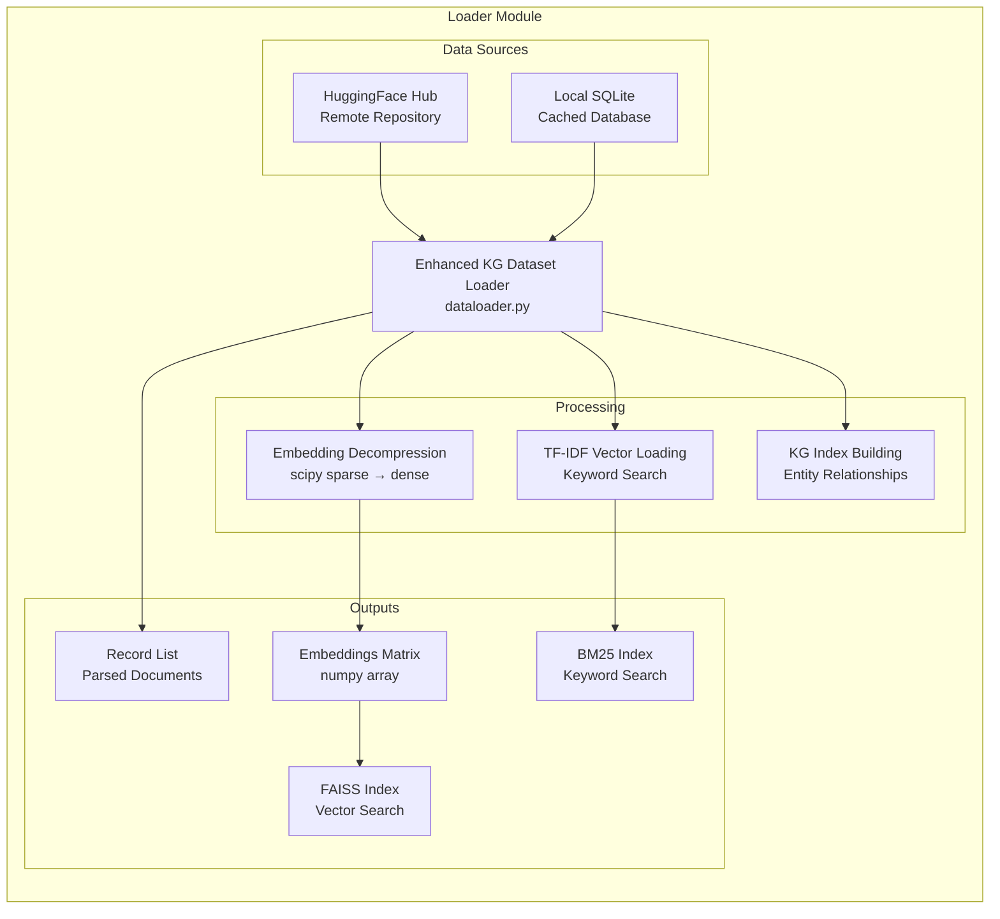

# Loader Module

Dataset loading and preprocessing for the Indonesian Legal RAG System. Handles HuggingFace dataset loading, SQLite extraction, embedding management, and index building.

## Architecture



## Components

| File | Description | Key Classes |
|------|-------------|-------------|
| `dataloader.py` | Main dataset loader with KG support | `EnhancedKGDatasetLoader` |
| `__init__.py` | Package exports | `EnhancedKGDatasetLoader`, `load_dataset` |

## Features

### 1. Dataset Loading from HuggingFace

```python
from loader import EnhancedKGDatasetLoader

# Initialize loader
loader = EnhancedKGDatasetLoader(
    dataset_name="Azzindani/ID_REG_DB_2510",
    embedding_model=embedding_model
)

# Load from HuggingFace (downloads and caches)
loader.load(progress_callback=lambda msg: print(msg))

# Access data
print(f"Total records: {len(loader.records)}")
print(f"Embeddings shape: {loader.embeddings.shape}")
```

### 2. Local Dataset Loading

```python
from loader import EnhancedKGDatasetLoader

# Load from local SQLite
loader = EnhancedKGDatasetLoader(
    local_path="./data/legal_db.sqlite",
    embedding_model=embedding_model
)

# Load locally
loader.load_from_local(progress_callback=print)
```

### 3. Embedding Decompression

Pre-computed embeddings are stored compressed to reduce storage. The loader automatically decompresses them:

```python
# Embeddings are automatically decompressed from scipy sparse format
embeddings = loader.embeddings  # numpy array: (n_docs, embedding_dim)
```

### 4. TF-IDF Vector Loading

For keyword search support:

```python
# TF-IDF vectors for BM25 search
tfidf_matrix = loader.tfidf_matrix
vectorizer = loader.tfidf_vectorizer
```

### 5. Knowledge Graph Index Building

```python
# Build KG indexes after loading
loader._build_enhanced_kg_indexes()

# Access KG data
kg_entities = loader.kg_entity_index
kg_relations = loader.kg_relation_index
```

## Usage Examples

### Complete Initialization Flow

```python
from loader import EnhancedKGDatasetLoader
from core.model_manager import get_model_manager

# Get embedding model
model_manager = get_model_manager()
embedding_model = model_manager.load_embedding_model()

# Initialize loader
loader = EnhancedKGDatasetLoader(
    dataset_name="Azzindani/ID_REG_DB_2510",
    embedding_model=embedding_model,
    cache_dir=".cache"
)

# Load with progress
def on_progress(msg):
    print(f"[LOADER] {msg}")

loader.load(progress_callback=on_progress)

# Get statistics
stats = loader.get_statistics()
print(f"Documents: {stats['total_documents']}")
print(f"Regulation types: {stats['regulation_types']}")
print(f"Year range: {stats['year_min']} - {stats['year_max']}")
```

### Integration with Search Engine

```python
from loader import EnhancedKGDatasetLoader
from core.search import HybridSearchEngine

# Load data
loader = EnhancedKGDatasetLoader(...)
loader.load()

# Pass to search engine
search_engine = HybridSearchEngine(
    records=loader.records,
    embeddings=loader.embeddings,
    tfidf_matrix=loader.tfidf_matrix,
    vectorizer=loader.tfidf_vectorizer,
    embedding_model=loader.embedding_model
)
```

## Dataset Structure

The loader expects datasets with these columns:

| Column | Type | Description | Required |
|--------|------|-------------|----------|
| `content` | string | Full document text | ✅ |
| `regulation_type` | string | UU, PP, Perpres, Permenaker, etc. | ✅ |
| `regulation_number` | string | Regulation number | ✅ |
| `year` | string | Publication year | ✅ |
| `about` | string | Subject matter/title | ✅ |
| `article` | string | Article number (if applicable) | No |
| `chapter` | string | Chapter/section | No |
| `enacting_body` | string | Issuing authority | No |
| `effective_date` | string | When regulation became effective | No |
| `embedding` | bytes | Pre-computed embedding (compressed) | No |
| `tfidf_vector` | bytes | Pre-computed TF-IDF vector | No |

## Configuration

| Variable | Default | Description |
|----------|---------|-------------|
| `DATASET_NAME` | "Azzindani/ID_REG_DB_2510" | HuggingFace dataset name |
| `CACHE_DIR` | ".cache" | Cache directory for downloads |
| `USE_LOCAL_DATA` | false | Prefer local over remote |
| `LOCAL_DATA_PATH` | None | Path to local SQLite database |

## Performance Notes

### Loading Times (typical)

| Operation | Time | Notes |
|-----------|------|-------|
| HuggingFace download | 2-5 min | First run only, then cached |
| SQLite parsing | 30-60s | ~25,000 records |
| Embedding decompression | 10-20s | Sparse → dense conversion |
| TF-IDF loading | 5-10s | Vocabulary + matrix |
| KG index building | 10-20s | Entity extraction + indexing |

### Memory Usage

| Component | Size | Notes |
|-----------|------|-------|
| Records | ~500 MB | All document metadata |
| Embeddings | ~1-2 GB | Dense float16 matrix |
| TF-IDF | ~200 MB | Sparse matrix |
| KG Index | ~100 MB | Entity dictionaries |

## Testing

```bash
# Run loader tests
python -m pytest tests/unit/test_dataloader.py -v

# Test with actual dataset
python -c "
from loader import EnhancedKGDatasetLoader
loader = EnhancedKGDatasetLoader()
loader.load()
print(f'Loaded {len(loader.records)} records')
"
```

## Dependencies

- `huggingface_hub`: Dataset downloading
- `sqlite3`: Local database access (standard library)
- `numpy`: Embedding arrays
- `scipy`: Sparse matrix handling
- `sklearn`: TF-IDF vectorization
- `torch`: Tensor operations

## Future Enhancements

- [ ] Incremental loading for large datasets
- [ ] Streaming support for memory efficiency
- [ ] Multi-dataset merging
- [ ] Automatic embedding regeneration
- [ ] Dataset versioning and updates
