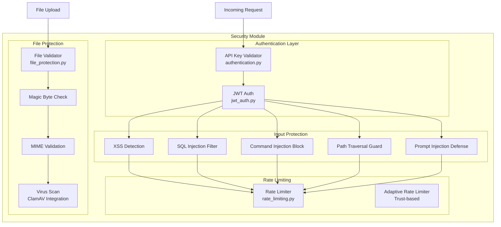

# Security Module

Comprehensive security layer for the Indonesian Legal RAG System, providing authentication, input validation, rate limiting, and file protection.

## Architecture



## Components

| File | Description | Key Functions |
|------|-------------|---------------|
| `jwt_auth.py` | JWT token creation and verification | `create_token()`, `verify_token()`, `register_user()`, `authenticate_user()` |
| `authentication.py` | API key validation with timing-safe comparison | `APIKeyValidator`, `validate_api_key()` |
| `input_safety.py` | XSS, SQL injection, and prompt injection prevention | `sanitize_query()`, `is_safe_input()`, `check_for_injection()` |
| `rate_limiting.py` | Request rate limiting with sliding window | `RateLimiter`, `AdaptiveRateLimiter`, `check_rate_limit()` |
| `file_protection.py` | File upload validation and virus scanning | `FileValidator`, `validate_upload()`, `check_file_header()` |

## Features

### 1. JWT Authentication (`jwt_auth.py`)

```python
from security import create_token, verify_token, authenticate_user

# Authenticate user
user = authenticate_user("username", "password")
if user:
    # Create JWT token
    token = create_token({"sub": user["username"]}, expires_minutes=60)
    
    # Later: verify token
    payload = verify_token(token)
    print(f"User: {payload['sub']}")
```

**Configuration:**
- `JWT_SECRET_KEY`: Secret key (set via environment variable)
- `JWT_ALGORITHM`: HS256 (default)
- `JWT_EXPIRATION_MINUTES`: Token expiration (default: 60)

### 2. API Key Validation (`authentication.py`)

```python
from security import validate_api_key, APIKeyValidator

# Quick validation
is_valid = validate_api_key("your-api-key")

# With validator instance
validator = APIKeyValidator(
    master_key="master-secret-key",
    additional_keys=["key1", "key2"]
)
result = validator.validate("key1")
```

**Features:**
- Timing-safe comparison (prevents timing attacks)
- Multiple key support
- Token bucket rate limiting per key

### 3. Input Sanitization (`input_safety.py`)

```python
from security import sanitize_query, is_safe_input, escape_html

# Sanitize user query
safe_query = sanitize_query("<script>alert('xss')</script>")
# Returns: "scriptalert('xss')/script"

# Check if input is safe
if is_safe_input(user_input):
    process(user_input)
else:
    reject(user_input)

# Escape HTML for display
escaped = escape_html("<b>Bold</b>")
# Returns: "&lt;b&gt;Bold&lt;/b&gt;"
```

**Protected Against:**
| Attack Type | Detection Pattern | Action |
|-------------|-------------------|--------|
| XSS | `<script>`, `javascript:`, `onerror=` | Strip/escape |
| SQL Injection | `UNION`, `SELECT`, `DROP`, `--` | Block |
| Command Injection | `; rm`, `| cat`, `` `cmd` `` | Block |
| Path Traversal | `../`, `..\\`, absolute paths | Block |
| Prompt Injection | `ignore previous`, `system:` | Block |

### 4. Rate Limiting (`rate_limiting.py`)

```python
from security import get_limiter, RateLimiter

# Get global limiter
limiter = get_limiter()

# Check rate limit
allowed = limiter.check_rate_limit(
    identifier="user-123",
    requests_per_minute=60,
    requests_per_hour=1000
)

if not allowed:
    raise HTTPException(429, "Too Many Requests")
```

**Configuration:**
| Setting | Default | Description |
|---------|---------|-------------|
| `RATE_LIMIT_REQUESTS_PER_MINUTE` | 60 | Max requests/minute |
| `RATE_LIMIT_REQUESTS_PER_HOUR` | 1000 | Max requests/hour |
| `RATE_LIMIT_CLEANUP_INTERVAL` | 60s | Cleanup old entries |

### 5. File Protection (`file_protection.py`)

```python
from security import FileValidator, validate_upload

# Validate file upload
validator = FileValidator(
    max_size_mb=50,
    allowed_extensions=['pdf', 'docx', 'txt'],
    allowed_mimetypes=['application/pdf', 'application/vnd.openxmlformats-officedocument.wordprocessingml.document']
)

# Quick validation
result = validate_upload(file_path, validator)

if not result['valid']:
    print(f"Rejected: {result['reason']}")
```

**Protection Layers:**
1. **Extension Check**: Whitelist of allowed extensions
2. **MIME Type Validation**: Verify content type header
3. **Magic Byte Check**: Verify file signature matches extension
4. **Size Limit**: Configurable max file size
5. **Virus Scan**: Optional ClamAV integration

## Integration with API

The security module is integrated into the FastAPI server:

```python
# api/server.py
from security import sanitize_query, validate_api_key
from api.middleware.auth import APIKeyMiddleware
from api.middleware.rate_limiter import SimpleRateLimiter

app = FastAPI()

# Add security middleware
app.add_middleware(APIKeyMiddleware, exempt_paths=['/health', '/docs'])
app.add_middleware(SimpleRateLimiter, requests_per_minute=60)

# In route handlers
@app.post("/query")
async def query(request: QueryRequest):
    safe_query = sanitize_query(request.query)
    # Process safe query...
```

## Environment Variables

| Variable | Required | Description |
|----------|----------|-------------|
| `JWT_SECRET_KEY` | ⚠️ Production | JWT signing key (auto-generated if not set) |
| `LEGAL_API_KEY` | ✅ Yes | Primary API key for authentication |
| `LEGAL_API_KEYS_ADDITIONAL` | No | Comma-separated additional API keys |
| `ENABLE_VIRUS_SCAN` | No | Enable ClamAV virus scanning (default: false) |
| `MAX_UPLOAD_SIZE_MB` | No | Max file upload size (default: 50) |

## Testing

```bash
# Run security tests
python -m pytest tests/test_security_module.py -v

# Run integration security tests
python tests/integration/test_security_integration.py
```

## Security Best Practices

### Production Deployment Checklist

- [ ] Set `JWT_SECRET_KEY` to a strong, unique value
- [ ] Use HTTPS in production
- [ ] Enable rate limiting
- [ ] Configure allowed CORS origins
- [ ] Enable virus scanning for file uploads
- [ ] Regularly rotate API keys
- [ ] Monitor for unusual request patterns

### Common Issues

| Issue | Solution |
|-------|----------|
| "API key not valid" | Check `LEGAL_API_KEY` environment variable |
| "Rate limit exceeded" | Wait or adjust `RATE_LIMIT_REQUESTS_PER_MINUTE` |
| "Malicious input detected" | Review input for SQL/XSS patterns |
| "File type not allowed" | Check `ALLOWED_UPLOAD_EXTENSIONS` |
