# 🧪 Testing Guide

Complete test suite for the Indonesian Legal RAG system.

## Architecture

```mermaid
flowchart TB
    subgraph "Test Suite"
        direction TB
        
        subgraph "Unit Tests (No API)"
            UT1[test_llm_providers.py<br/>Provider Logic]
            UT2[test_generation.py<br/>LLM Engine]
            UT3[test_hybrid_search.py<br/>Search Scoring]
            UT4[test_consensus.py<br/>Consensus Algorithms]
            UT5[test_knowledge_graph.py<br/>KG Functions]
            UT6[test_query_detection.py<br/>Query Classification]
            UT7[test_validators.py<br/>Input Validation]
            UT8[conversation/*<br/>Session & Export]
        end
        
        subgraph "Integration Tests (API Required)"
            IT1[test_production_ready.py<br/>Full System]
            IT2[test_streaming.py<br/>SSE Streaming]
            IT3[test_conversational.py<br/>Multi-turn]
            IT4[test_api_endpoints.py<br/>All Endpoints]
            IT5[test_security_integration.py<br/>Security Tests]
            IT6[test_concurrent_users.py<br/>Thread Safety]
        end
        
        subgraph "Stress Tests"
            ST1[test_stress_single.py<br/>Max Load Single]
            ST2[test_stress_conversational.py<br/>Max Load 7-turn]
        end
        
        subgraph "Document Parser Tests"
            DT1[test_document_parser.py<br/>Extractors]
            DT2[test_document_e2e.py<br/>Upload E2E]
            DT3[test_multi_turn_comprehensive.py<br/>8-turn + Docs]
        end
    end
    
    PYTEST[pytest] --> UT1 & UT2 & UT3 & UT4 & UT5 & UT6 & UT7 & UT8
    API[API Server] --> IT1 & IT2 & IT3 & IT4 & IT5 & IT6
    API --> ST1 & ST2
    API --> DT2 & DT3
```



## Test Categories Summary

| Category | Count | API Required | Typical Time |
|----------|-------|--------------|--------------|
| Unit Tests | 14 | ❌ No | < 2 min |
| Integration Tests | 17 | ✅ Yes | 30-60 min |
| Stress Tests | 2 | ✅ Yes | 20-30 min |
| Document Parser | 4 | Mixed | 15-20 min |
| LLM Provider | 5 | Mixed | 10-15 min |
| **Total** | **46** | | |

---

## 📋 Quick Reference

### All Tests at a Glance

| # | Test File | Purpose | API? | Time |
|---|-----------|---------|------|------|
| **Unit Tests** |
| 1 | `unit/test_llm_providers.py` | LLM provider unit tests | ❌ | 5s |
| 2 | `unit/test_generation.py` | Generation engine | ❌ | 10s |
| 3 | `unit/test_hybrid_search.py` | Hybrid search scoring | ❌ | 5s |
| 4 | `unit/test_consensus.py` | Consensus algorithms | ❌ | 5s |
| 5 | `unit/test_context_cache.py` | Context caching | ❌ | 5s |
| 6 | `unit/test_dataloader.py` | Data loading | ❌ | 10s |
| 7 | `unit/test_knowledge_graph.py` | Knowledge graph | ❌ | 10s |
| 8 | `unit/test_query_detection.py` | Query classification | ❌ | 5s |
| 9 | `unit/test_validators.py` | Input validation | ❌ | 5s |
| 10 | `unit/test_virus_scanning.py` | ClamAV integration | ❌ | 5s |
| 11 | `unit/test_path_setup.py` | Path utilities | ❌ | 2s |
| 12 | `unit/conversation/test_session_storage.py` | SQLite sessions | ❌ | 10s |
| 13 | `unit/conversation/test_manager.py` | Conversation manager | ❌ | 5s |
| 14 | `unit/conversation/test_exporters.py` | Export formats | ❌ | 5s |
| **Integration Tests** |
| 15 | `integration/test_production_ready.py` | Full system validation | ✅ | 5min |
| 16 | `integration/test_api_endpoints.py` | All API endpoints | ✅ | 2min |
| 17 | `integration/test_api_http.py` | HTTP-level API tests | ✅ | 1min |
| 18 | `integration/test_api_integration.py` | Pipeline + API | ✅ | 3min |
| 19 | `integration/test_streaming.py` | SSE streaming | ✅ | 2min |
| 20 | `integration/test_conversational.py` | Multi-turn dialogue | ✅ | 5min |
| 21 | `integration/test_session_export.py` | Session export | ✅ | 2min |
| 22 | `integration/test_complete_rag.py` | Complete RAG pipeline | ✅ | 5min |
| 23 | `integration/test_complete_output.py` | Full metadata output | ✅ | 5min |
| 24 | `integration/test_audit_metadata.py` | Audit & scoring details | ✅ | 3min |
| 25 | `integration/test_performance.py` | Benchmarks & load | ✅ | 10min |
| 26 | `integration/test_concurrent_users.py` | Thread safety | ✅ | 2min |
| 27 | `integration/test_multi_user_sessions.py` | Multi-user sessions | ✅ | 2min |
| 28 | `integration/test_edge_cases.py` | Error handling | ✅ | 2min |
| 29 | `integration/test_security_integration.py` | Security tests | ✅ | 2min |
| 30 | `integration/test_end_to_end.py` | E2E with pytest | ✅ | 5min |
| 31 | `integration/test_integrated_system.py` | System integration | ✅ | 5min |
| **LLM Provider Tests** |
| 32 | `integration/test_llm_providers_simulation.py` | Provider simulation | ❌ | 1min |
| 33 | `integration/test_llm_provider_multi_turn.py` | Provider + multi-turn | ✅ | 5min |
| 34 | `integration/test_llamacpp_simulation.py` | LlamaCpp provider | ❌ | 1min |
| 35 | `integration/test_api_llamacpp.py` | LlamaCpp via API | ✅ | 3min |
| 36 | `integration/test_multiuser_jwt.py` | JWT authentication | ✅ | 2min |
| **Document Parser Tests** |
| 37 | `test_document_parser.py` | Extractors & storage | ❌ | 30s |
| 38 | `test_document_parser_integration.py` | Pipeline injection | ❌ | 30s |
| 39 | `test_document_e2e.py` | Document upload E2E | ✅ | 2min |
| 40 | `test_multi_turn_comprehensive.py` | 8-turn with docs | ✅ | 15min |
| **Stress Tests** |
| 41 | `integration/test_stress_single.py` | Max load single query | ✅ | 10min |
| 42 | `integration/test_stress_conversational.py` | Max load 7-turn | ✅ | 20min |
| **Other** |
| 43 | `test_hardware_allocation.py` | GPU/CPU detection | ❌ | 10s |
| 44 | `test_security_module.py` | Security helpers | ❌ | 10s |
| 45 | `api/test_enhanced_api.py` | Enhanced API tests | ✅ | 2min |
| 46 | `test_integration.py` | Basic integration | ✅ | 5min |

---

## 🚀 Common Setup

### Install Dependencies

```bash
pip install -r requirements.txt

# Document parser extras
pip install pypdf2 pdfplumber python-docx beautifulsoup4 pytesseract pillow
```

### Start API Server

```bash
# Option 1: With local LLM (requires GPU)
python -m api.server --llm-provider local

# Option 2: With LlamaCpp (GGUF models)
python -m api.server --llm-provider llamacpp

# Option 3: With OpenRouter (cloud API)
python -m api.server --llm-provider openrouter

# Option 4: RAG only (no LLM generation)
python -m api.server --llm-provider none
```

### Kaggle/Notebook Setup

```python
import threading, time, os, sys

os.chdir('/kaggle/working/06_ID_Legal')
sys.path.insert(0, '/kaggle/working/06_ID_Legal')
sys.argv = ['api.server', '--llm-provider', 'llamacpp']  # or 'none'

def start_api():
    import uvicorn
    from api.server import app
    uvicorn.run(app, host="127.0.0.1", port=8000)

api_thread = threading.Thread(target=start_api, daemon=True)
api_thread.start()
time.sleep(60)  # Wait for initialization
```

---

## 🧪 Running Tests

### Unit Tests (No API Required)

```bash
# All unit tests
python -m pytest tests/unit/ -v

# With coverage
python -m pytest tests/unit/ -v --cov=. --cov-report=html

# Specific test
python -m pytest tests/unit/test_llm_providers.py -v
```

### Integration Tests (Requires API)

```bash
# Start API first, then:
python tests/integration/test_production_ready.py
python tests/integration/test_streaming.py
python tests/integration/test_conversational.py
```

### Document Parser Tests

```bash
# Unit tests (no API)
python tests/test_document_parser.py

# Integration (no API)
python tests/test_document_parser_integration.py

# E2E (requires API)
python tests/test_document_e2e.py
```

### LLM Provider Tests

```bash
# Simulation (no API)
python tests/integration/test_llm_providers_simulation.py
python tests/integration/test_llamacpp_simulation.py

# With API
python tests/integration/test_api_llamacpp.py
python tests/integration/test_multiuser_jwt.py
```

### Stress Tests

```bash
# Single query max load
python tests/integration/test_stress_single.py

# 7-turn conversation max load
python tests/integration/test_stress_conversational.py

# Quick mode
python tests/integration/test_stress_single.py --quick
```

---

## 📊 Test Categories Explained

### Unit Tests
Fast, isolated tests for individual components. No external dependencies.

### Integration Tests
Test component interactions. Most require the API server running.

### LLM Provider Tests
Test different LLM backends (local, LlamaCpp, OpenRouter, none).

| Provider | Description | GPU Required |
|----------|-------------|--------------|
| `local` | HuggingFace transformers | ✅ Yes |
| `llamacpp` | GGUF models (hybrid CPU/GPU) | Optional |
| `openrouter` | Cloud API (200+ models) | ❌ No |
| `none` | RAG only, no generation | ❌ No |

### Document Parser Tests
Test document upload, parsing, and context injection.

| Format | Extractor | Dependencies |
|--------|-----------|--------------|
| PDF | pypdf2, pdfplumber | `pip install pypdf2 pdfplumber` |
| DOCX | python-docx | `pip install python-docx` |
| HTML | beautifulsoup4 | `pip install beautifulsoup4` |
| Images | pytesseract/EasyOCR | Tesseract installed |
| URLs | requests | Built-in |

### Stress Tests
Maximum load testing with all settings maxed:
- 5 search phases
- 600-800 candidates per phase
- 5 research personas
- 20 final documents
- 8192 max tokens

---

## 🔍 Specific Test Details

### Production Readiness (`test_production_ready.py`)

Validates complete system including:
- Simple queries
- Complex legal queries
- Multi-turn conversations
- Bug fix regressions
- Performance baselines

### Streaming (`test_streaming.py`)

Tests real-time token streaming:
- Direct pipeline streaming
- SSE API streaming
- Session-based streaming

```bash
# Direct pipeline only
python tests/integration/test_streaming.py

# With API SSE
python tests/integration/test_streaming.py --api
```

### Audit & Metadata (`test_audit_metadata.py`)

Full transparency into scoring:
- Semantic, keyword, KG scores
- Authority, temporal, completeness
- Weight calculations
- Phase-by-phase results
- Persona contributions

```bash
python tests/integration/test_audit_metadata.py --query "Apa sanksi UU ITE?"
```

### Performance (`test_performance.py`)

Benchmarking and load testing:
- Response times by query type
- P50/P90/P99 latencies
- Throughput (QPS)
- Memory profiling
- Concurrent load

```bash
python tests/integration/test_performance.py --full
python tests/integration/test_performance.py --concurrent --threads 3
python tests/integration/test_performance.py --memory
```

---

## 🛠️ Bug Fix Verification

### Division by Zero (hybrid_search.py)
```bash
python -m pytest tests/unit/test_hybrid_search.py -v -k "weight"
```

### XML Parsing (generation_engine.py)
```bash
python -m pytest tests/unit/test_generation.py -v
```

### Rate Limiting
```bash
python tests/integration/test_security_integration.py
```

### Input Validation
```bash
python -m pytest tests/unit/test_validators.py -v
```

---

## 📁 Test Directory Structure

```
tests/
├── unit/                          # Fast, isolated tests
│   ├── conversation/              # Conversation components
│   │   ├── test_session_storage.py
│   │   ├── test_manager.py
│   │   └── test_exporters.py
│   ├── test_llm_providers.py
│   ├── test_generation.py
│   ├── test_hybrid_search.py
│   └── ...
├── integration/                   # Component interaction tests
│   ├── test_production_ready.py
│   ├── test_streaming.py
│   ├── test_llamacpp_simulation.py
│   ├── test_multiuser_jwt.py
│   └── ...
├── api/                           # API-specific tests
│   └── test_enhanced_api.py
├── test_documents/                # Sample documents for testing
├── test_document_parser.py        # Document parser unit tests
├── test_document_e2e.py           # Document E2E tests
└── README.md                      # This file
```

---

## ✅ Recommended Test Sequence

### For Development
```bash
# 1. Unit tests (fast feedback)
python -m pytest tests/unit/ -v

# 2. Basic integration
python tests/integration/test_production_ready.py
```

### For Pre-Commit
```bash
# 1. All unit tests
python -m pytest tests/unit/ -v

# 2. Core integration
python tests/integration/test_api_endpoints.py
python tests/integration/test_streaming.py
```

### For Release
```bash
# Full test suite
python -m pytest tests/unit/ -v
python tests/integration/test_production_ready.py
python tests/integration/test_complete_rag.py
python tests/integration/test_stress_single.py --quick
```

---

## 📈 Expected Results

### Unit Tests
- **Total:** ~50 tests
- **Time:** < 2 minutes
- **Pass Rate:** 100%

### Integration Tests  
- **Total:** ~30 tests
- **Time:** 10-30 minutes (depends on GPU)
- **Pass Rate:** 95%+ (some may skip without deps)

### Stress Tests
- **Time:** 10-20 minutes per test
- **Memory:** May spike to 90%+ VRAM
- **Pass Rate:** 100% (or OOM if insufficient resources)
