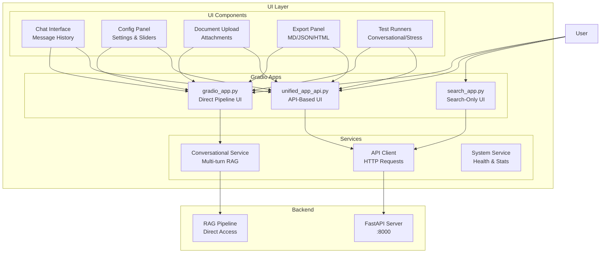

# UI Module

Gradio-based web interface for the Indonesian Legal RAG System.

## Architecture



## Directory Structure

```
ui/
├── __init__.py               # Package exports
├── gradio_app.py             # Direct pipeline UI (1129 lines)
├── unified_app_api.py        # API-based UI (2316 lines)
├── search_app.py             # Search-only UI
└── services/
    ├── __init__.py           # Service exports
    ├── api_client.py         # HTTP API client
    ├── conversational_service.py  # Multi-turn RAG service
    └── system_service.py     # Health, stats, initialization
```

## Quick Start

```bash
python ui/gradio_app.py
```

Then open http://localhost:7860 in your browser.

## Features

- Chat interface for legal Q&A
- Conversation history tracking
- Session export (Markdown, JSON, HTML)
- Example questions
- Real-time response streaming

## Usage

### Standalone

```python
from ui import launch_app

# Launch with defaults
launch_app()

# Custom configuration
launch_app(
    share=True,      # Create public link
    server_port=7860
)
```

### With Custom Pipeline

```python
import gradio as gr
from ui.gradio_app import create_demo

demo = create_demo()
demo.launch(server_name="0.0.0.0", server_port=7860)
```

## Interface Commands

- Type questions in Indonesian or English
- `/export [md|json|html]` - Export conversation
- `/history` - View conversation history
- `/clear` - Start new session

## Docker

```bash
docker-compose --profile ui up
```

This starts both the API and UI services.

## Configuration

Environment variables:
- `API_URL` - Backend API URL (default: http://localhost:8000)

## Screenshots

The interface includes:
- Main chat panel (left)
- Action buttons (right)
- Export options
- Session info
- Example questions

## LLM Provider Integration

The UI supports multiple LLM providers via OpenRouter or local GPU.

### Configuration (Settings Tab)

1. Go to **⚙️ Pengaturan Sistem** tab
2. In **🤖 LLM Provider** section:
   - Select provider: `local`, `openrouter`, or `none`
   - For OpenRouter: enter API key and select model preset
3. Click **Apply** to save

### Available Model Presets

| Preset | Model | Notes |
|--------|-------|-------|
| 🆓 Nvidia Nemotron | `nvidia/nemotron-3-nano-30b-a3b:free` | Fast, free |
| 🆓 DeepSeek R1 | `deepseek/deepseek-r1-0528:free` | Reasoning |
| 🆓 GPT OSS | `openai/gpt-oss-20b:free` | Smaller |
| ⭐ Claude Sonnet 4 | `anthropic/claude-sonnet-4` | Premium |

### API Client Methods

```python
from ui.services.api_client import create_api_client

client = create_api_client()

# Get current LLM status
status = client.get_llm_status()

# Configure OpenRouter
client.configure_llm("openrouter", model="nvidia/nemotron-3-nano-30b-a3b:free", api_key="sk-or-...")

# Test connection
result = client.test_llm_connection()
```

## Test Runners

Located in Settings tab → **🧪 Test Runners**:

| Button | Description |
|--------|-------------|
| 🧪 Conversational Test | 8 questions, topic continuity |
| ⚡ Stress Test | Maximum settings |
| 📄 Document Test | File upload simulation |
| 🤖 LLM Provider Test | **10 turns** with provider switching & fallback |

### LLM Provider Test (10 Turns)

Tests full OpenRouter integration:
- Turns 1-8: Basic Q&A, memory, thinking levels
- Turn 9: **Provider Switch** (→ DeepSeek)
- Turn 10: **Fallback Chain** (invalid model → fallback)

```bash
# Run standalone test
python tests/integration/test_llm_provider_multi_turn.py
```

## Running on Kaggle

### Step 1: Start API Server

```python
import threading
import time
import os
import sys

os.chdir('/kaggle/working/06_ID_Legal')
sys.path.insert(0, '/kaggle/working/06_ID_Legal')
sys.argv = ['api.server', '--llm-provider', 'none']

def start_api():
    import uvicorn
    from api.server import app
    uvicorn.run(app, host="127.0.0.1", port=8000, log_level="info")

api_thread = threading.Thread(target=start_api, daemon=True)
api_thread.start()
print("⏳ Waiting 60 seconds for API to start...")
time.sleep(60)
print("✅ API Ready!")
```

### Step 2: Launch UI

```python
from ui.unified_app_api import launch_app
launch_app(share=True)  # Creates public Gradio link
```

### Step 3: Configure OpenRouter

1. Click the **⚙️ Pengaturan Sistem** tab
2. In **🤖 LLM Provider**:
   - Select `openrouter` from dropdown
   - Enter your OpenRouter API key
   - Select model preset (e.g., Nvidia Nemotron)
   - Click **Apply**
3. Click **🤖 LLM Provider Test (10 Turns)** button

### Step 4: Run Standalone Test (Alternative)

```python
import os
os.environ["OPENROUTER_API_KEY"] = "sk-or-v1-your-key-here"
!python tests/integration/test_llm_provider_multi_turn.py
```

