# Utils Module

Shared utility functions and helper modules for the Indonesian Legal RAG System.

## Architecture

```mermaid
flowchart TB
    subgraph "Utils Module"
        direction TB
        
        subgraph "Logging & Monitoring"
            LOG[Logger Utils<br/>Centralized Logging]
            HEALTH[Health Checks<br/>System Status]
            SYS[System Info<br/>Hardware Detection]
        end
        
        subgraph "Memory Management"
            MEM[Memory Utils<br/>GPU/CPU Cleanup]
            GPU[GPU Memory<br/>CUDA Management]
        end
        
        subgraph "Text Processing"
            TEXT[Text Utils<br/>Parsing & Formatting]
            FMT[Formatting<br/>Document Display]
            SEARCH[Search Formatting<br/>Result Display]
        end
        
        subgraph "Research & Export"
            TRANS[Research Transparency<br/>Process Logging]
            EXPORT[Export Helpers<br/>File Generation]
            AUDIT[Conversation Audit<br/>History Review]
        end
    end
    
    API[API Layer] --> LOG
    API --> HEALTH
    PIPE[Pipeline] --> MEM & GPU
    PIPE --> TEXT & FMT
    UI[UI Layer] --> SEARCH & EXPORT
```



## Components

| File | Description | Key Exports |
|------|-------------|-------------|
| `logger_utils.py` | Centralized logging with file output | `get_logger()`, `initialize_logging()`, `ProgressTracker` |
| `memory_utils.py` | GPU/CPU memory management | `cleanup_memory()`, `aggressive_cleanup()`, `get_memory_stats()` |
| `gpu_memory.py` | CUDA-specific memory utilities | `get_gpu_memory()`, `clear_gpu_cache()` |
| `health.py` | System health monitoring | `system_health_check()`, `format_health_report()` |
| `system_info.py` | System and dataset information | `format_system_info()`, `get_dataset_statistics()` |
| `text_utils.py` | Text processing utilities | `parse_think_tags()`, `clean_text()` |
| `formatting.py` | Document and result formatting | `format_sources_info()`, `format_all_documents()` |
| `search_formatting.py` | Search-specific formatting | `format_search_results()`, `export_search()` |
| `research_transparency.py` | Research process logging | `format_detailed_research_process()` |
| `export_helpers.py` | File export utilities | `export_to_markdown()`, `export_to_json()` |
| `conversation_audit.py` | Conversation review tools | `audit_conversation()` |
| `path_setup.py` | Import path configuration | `setup_paths()` |

## Features

### 1. Centralized Logging (`logger_utils.py`)

Thread-safe, centralized logging with file output and verbosity control.

```python
from utils.logger_utils import get_logger, initialize_logging

# Initialize once at startup
initialize_logging(
    enable_file_logging=True,
    log_dir="logs",
    verbosity_mode="normal"  # minimal, normal, verbose
)

# Get module-specific logger
logger = get_logger("MyModule")

# Log messages
logger.info("Processing started", {"items": 100})
logger.warning("Memory low", {"available_gb": 2.5})
logger.error("Failed to load", {"error": str(e)})
logger.success("Completed successfully")
```

**Verbosity Modes:**
| Mode | Console Output |
|------|----------------|
| `minimal` | ERROR, WARNING, SUCCESS only |
| `normal` | + INFO messages |
| `verbose` | + DEBUG messages |

### 2. Memory Management (`memory_utils.py`)

```python
from utils.memory_utils import (
    cleanup_memory,
    aggressive_cleanup,
    prepare_for_llm,
    get_memory_stats,
    log_memory_state
)

# Standard cleanup after retrieval
cleanup_memory(aggressive=False, reason="after search")

# Aggressive cleanup before LLM generation
prepare_for_llm()

# Get current memory stats
stats = get_memory_stats()
print(f"GPU allocated: {stats['gpu']['allocated_mb']:.1f} MB")
print(f"GPU available: {stats['gpu']['available_mb']:.1f} MB")

# Log current state
log_memory_state("Before generation")
```

### 3. Health Monitoring (`health.py`)

```python
from utils.health import system_health_check, format_health_report

# Run health check
health = system_health_check(
    pipeline=rag_pipeline,
    manager=conversation_manager,
    initialization_complete=True
)

# Check status
if health['status'] == 'critical':
    print("System unhealthy!")
    for issue in health['issues']:
        print(f"  - {issue}")

# Format for display
report = format_health_report(health)
print(report)  # Markdown formatted
```

**Health Check Components:**
- Pipeline initialization status
- Manager initialization status
- RAM usage (warning at 80%, critical at 90%)
- GPU memory per device
- Issue list

### 4. Text Processing (`text_utils.py`)

```python
from utils.text_utils import parse_think_tags, clean_text

# Parse LLM output with <think> tags
response = "<think>Let me analyze this...</think>The answer is..."
thinking, answer = parse_think_tags(response)
print(f"Thinking: {thinking}")
print(f"Answer: {answer}")

# Clean text
cleaned = clean_text(raw_text)
```

### 5. Document Formatting (`formatting.py`)

```python
from utils.formatting import (
    format_sources_info,
    format_all_documents,
    format_retrieved_metadata
)

# Format source citations
sources_display = format_sources_info(citations, metadata)

# Format all retrieved documents
docs_display = format_all_documents(result, max_docs=50)

# Format retrieval metadata
metadata_display = format_retrieved_metadata(retrieval_result)
```

### 6. Research Transparency (`research_transparency.py`)

```python
from utils.research_transparency import (
    format_detailed_research_process,
    format_researcher_summary
)

# Get detailed research log
research_log = format_detailed_research_process(
    result,
    show_content=False  # Don't include full document text
)

# Get researcher contributions
researcher_summary = format_researcher_summary(result)
```

### 7. System Information (`system_info.py`)

```python
from utils.system_info import format_system_info, get_dataset_statistics

# Get formatted system info
sys_info = format_system_info()
print(sys_info)

# Get dataset statistics
stats = get_dataset_statistics(dataset_loader)
print(f"Total documents: {stats['total_docs']}")
print(f"Regulation types: {stats['regulation_types']}")
```

## Usage Examples

### Complete Initialization Flow

```python
from utils.logger_utils import initialize_logging, get_logger
from utils.memory_utils import prepare_for_llm
from utils.health import system_health_check

# 1. Initialize logging
initialize_logging(verbosity_mode="normal")

logger = get_logger("Main")
logger.info("Starting application")

# 2. Prepare GPU memory
prepare_for_llm()

# 3. Initialize components...
pipeline = RAGPipeline()
pipeline.initialize()

# 4. Check health
health = system_health_check(pipeline=pipeline)
if health['status'] != 'healthy':
    logger.warning("System not fully healthy", {"issues": health['issues']})
```

### Memory Management in Pipeline

```python
from utils.memory_utils import (
    cleanup_after_retrieval,
    cleanup_after_expansion,
    prepare_for_llm
)

# After document retrieval
results = search_engine.search(query)
cleanup_after_retrieval(len(results))

# After document expansion
expanded = expansion_engine.expand(results)
cleanup_after_expansion(len(expanded))

# Before LLM generation
prepare_for_llm()
response = llm_engine.generate(prompt)
```

## Configuration

Most utilities use environment variables from `config.py`:

| Variable | Default | Description |
|----------|---------|-------------|
| `LOG_VERBOSITY` | "minimal" | Logging verbosity level |
| `ENABLE_FILE_LOGGING` | true | Write logs to file |
| `LOG_DIR` | "logs" | Log file directory |

## Testing

```bash
# Run utility tests
python -m pytest tests/unit/test_path_setup.py -v

# Test memory utilities (requires GPU)
python -c "from utils.memory_utils import get_memory_stats; print(get_memory_stats())"

# Test logging
python -c "from utils.logger_utils import get_logger; l = get_logger('Test'); l.info('Hello')"
```

## Dependencies

- `torch` (optional): GPU memory management
- `psutil` (optional): System memory monitoring
- `threading`: Thread-safe logging
- `datetime`: Timestamps and formatting
